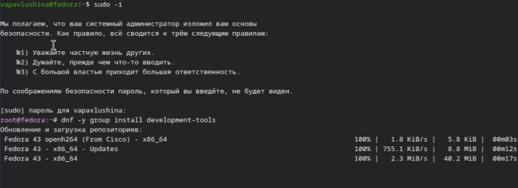
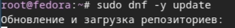
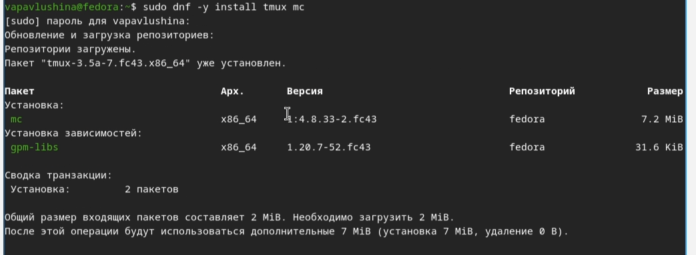
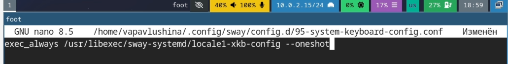
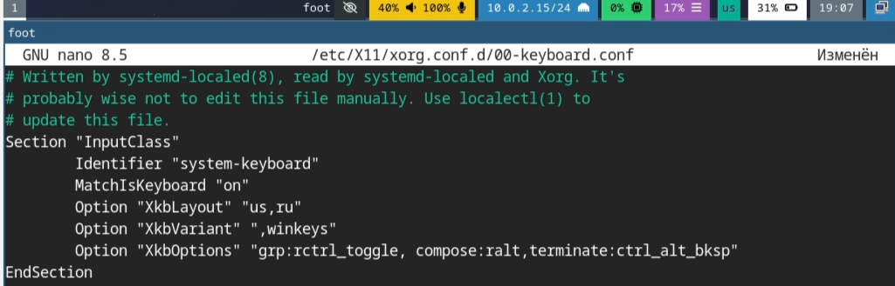
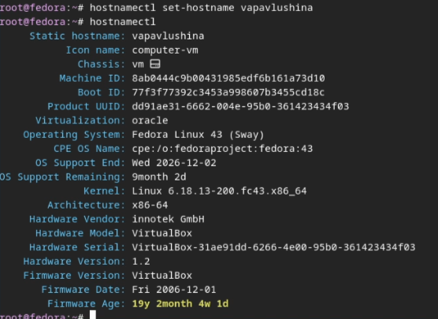
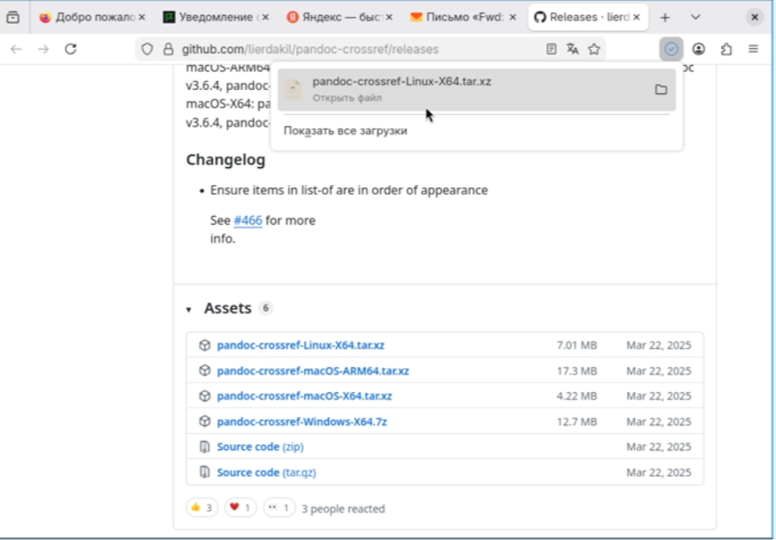
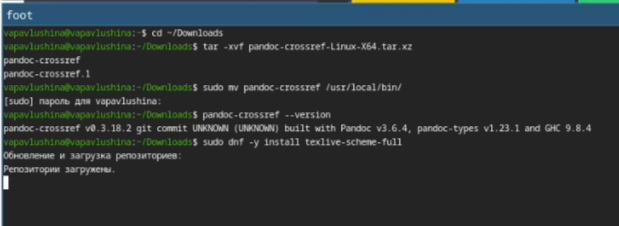

---
## Author
author:
  name: Павлушина Виктория Александровна
  group: НКАбд-05-25
  student-id: 1032253555
  email: akutagawa_39@bk.ru
  affiliation:
    - name: Российский университет дружбы народов
      country: Российская Федерация
      city: Москва
      address: ул. Миклухо-Маклая, д. 6
      
## Title
title: Архитектура компьютеров и операционные системы
subtitle: Презентация по Лабораторной работе №1
license: CC BY
date: 07.03.2026
date-format: "2026-03-07" 
---

# Информация

## Докладчик

:::::::::::::: {.columns align=center}
::: {.column width="70%"}

  * Павлушина Виктория Александровна
  * Студент ФМиЕН
  * Направление подготовки: Компьютерные и информационные науки
  * Российский университет дружбы народов им. П. Лумумбы
  * [akutagawa_39@bk.ru](mailto:akutagawa_39@bk.ru)
  * <https://github.com/vapavlushina>

:::
::: {.column width="30%"}

:::
::::::::::::::

# Вводная часть

Освоение навыков уставновки, настройки и администрирования операционных систем является фундаментальной задачей подготовки специалистов в области информационных технологий и компьютерных наук. Особое значение приорбретает опыт работы с операционными системами семейства Linux, широко применяемыми в серверной среде, разработке программного обеспечения и научных вычислениях благодаря своей гибкости, открытости и надёжности. 

## Актуальность

- Linux является доминирующей платформой на рынке веб-серверов.
- Виртуализация стала стандартом для эффективного использования аппаратных ресурсов , тестирования аппаратного обеспечения.

## Объект и предмет исследования

- Объект: Системы контроля версий
- Предмет: Первоначальная настройка Git и сопутствующих инструментов
- 
## Цели и задачи

Цель работы: Изучить идеологию и применение средств контроля версий. Освоить уменя по работе с git.

Задачи: 
1. Создать базовую конфигурацию для работ с git.
2. Создать ключи SSH и PGP.
3. Настроить подписи коммитов git.
4. Зарегистрироваться на GitHub.
5. Создать локальный каталог для выполнения заданий.

## Материалы и методы

- Git - система контроля версий.
- GitHub - платформа для хостинга репозиториев.
- Утилиты: ssh-key, gpg, gh.
- Командная строка: Linux.

# Выполнение работы

## Создание виртуальной машины Linux

{width=60%}
{width=60%}

Загрузили LiveCD.
{width=60%}

Установили средства разработки.
{width=60%}
{width=60%}

Установили драйвера.
{#width=60%}

Добавляем пользователя в необходимую папку.
{width=60%}

Обновляем все пакеты.
{width=60%}

## Скачиваем программы для удобства работы в консоли
{width=60%}
{width=60%} 

## Автоматическое обновление.
{width=60%}

## Отключаем SELinux
{width=60%}

## Настраиваем раскладку клавиатуры
{width=60%}
{width=60%}

Редактируем
{width=60%}
{width=60%}

Установка имени пользователя и названия хоста.
{width=60%}
{width=60%}

## Установка программного обеспечения для создания документации
{width=60%}
{width=60%}
{width=60%}

# Вывод

 В ходе данной лабораторной работы мы научились работать с git, создали учётную запись в GitHub, ключи SSH и PGP, научились подписывать коммиты, работать с удалённым репозиторием и его локальной версией.
