---
## Author
author:
  name: Павлушина Виктория Александровна
  group: НКАбд-05-25
  student-id: 1032253555
  email: akutagawa_39@bk.ru
  affiliation:
    - name: Российский университет дружбы народов
      country: Российская Федерации
    

## Title
title: "Архитектура компьютеров и операционные системы"
subtitle: "Лабораторная работа №1"
license: "CC BY"
---
---

# **Цель работы**

Целью данной лабораторной работы является приобретение практических навыков установки операционной системы на виртуальную машину , настройки минимально необходимых для дальнейшей работы сервисов.

# **Задание**

- Установка Linux на VirtualBox
- Установка необходимого ПО
- Первоначальная настройка ОС для дальнейшей работы

# **Теоретическое введение**

Oracle VM VirtualBox - программа для виртуализации, позволяющая запускать несколько ОС на одном компьютере
Поддерживает гостевые системы Linux, Solaris, OS/2, Windows(XP-11), macOS (эксперементально)
Работает на хостах: Windows, Linux, macOS, FreeBSD, Solaris

# **Выполнение лабораторной работы**

Создаю виртуальную машину Linux ([рис. @fig:lab01-1])

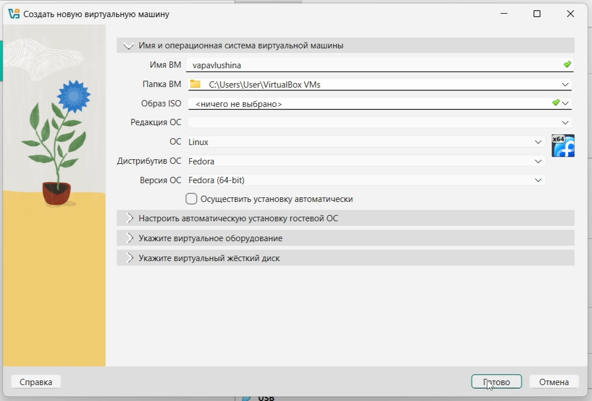{#fig:lab01-1}

Настраиваю виртуальную машину ([рис. @fig:lab01-2])
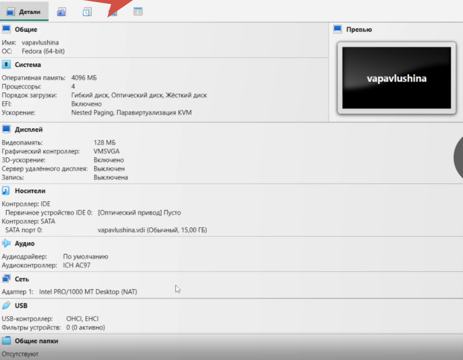{#fig:lab01-2}

Добавляю ISO файл ([рис. @fig:lab01-3])
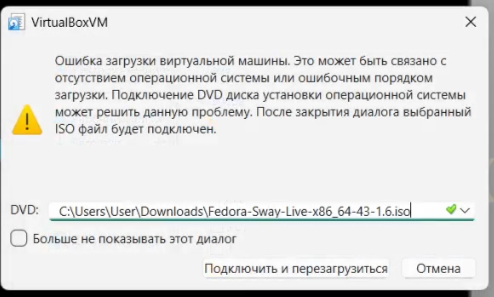{#fig:lab01-3}

Запускаю liveinst ([рис. @fig:lab01-4])
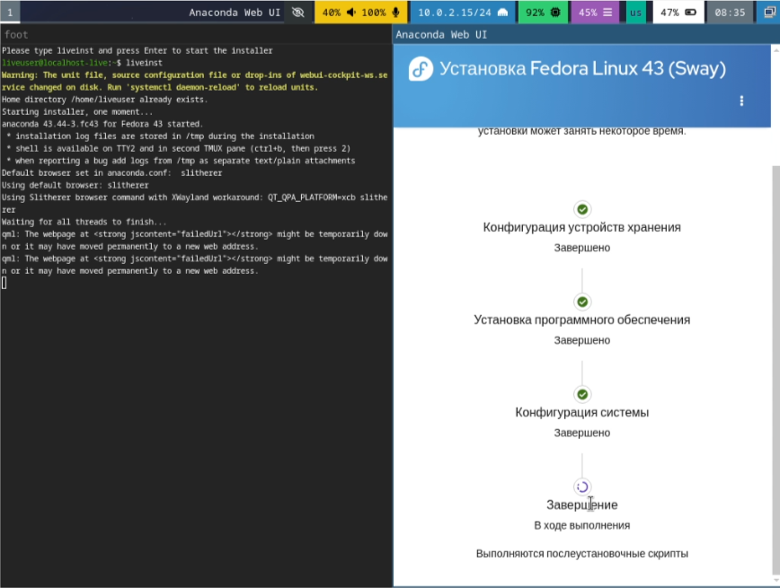{#fig:lab01-4}

После мы выходим из виртуальной машины, заходим в настройки, и удаляем устройство из контроллера IDE. Запускаем машину вновь, переходим в режим суперпользователя и скачиваем необходимые пакеты через development-tools ([рис. @fig:lab01-5]), затем скачиваем фреймворк ([рис. @fig:lab01-6])

{#fig:lab01-5}
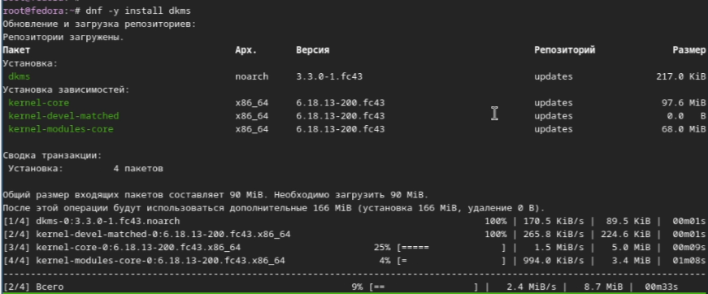{#fig:lab01-6}

Выходим из машины и добавляем оптический диск VBoxGuestAdditions.iso, заходим обратно, переходим в режим суперпользователя, делаем файловую систему доступной для чтения и записи в общей иерархии папок ([рис. @fig:lab01-7], [рис. @fig:lab01-8], [рис. @fig:lab01-9], [рис. @fig:lab01-10], [рис. @fig:lab01-11], [рис. @fig:lab01-12])

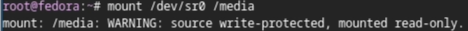{#fig:lab01-7}
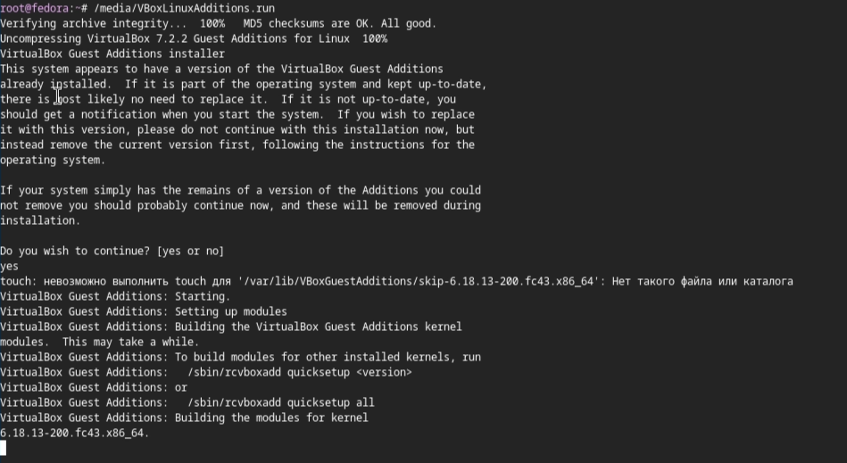{#fig:lab01-8}
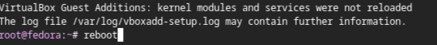{#fig:lab01-9}
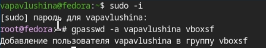{#fig:lab01-10}
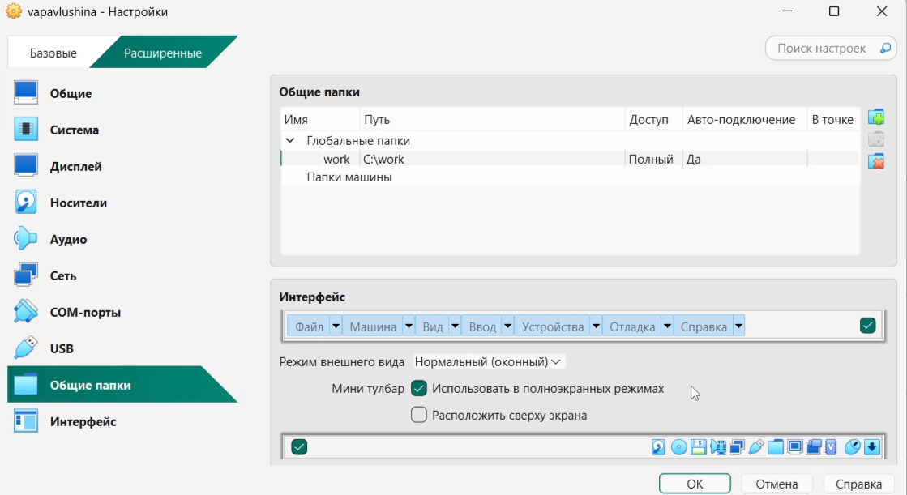{#fig:lab01-11}
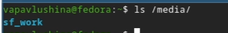{#fig:lab01-12}

Выполняем reboot, заходим в режим суперпользователя и обновляем пакеты ([рис. @fig:lab01-13])

{#fig:lab01-13}

Скачиваем программы для удобства работы в консоли [рис. @fig:lab01-14],[рис. @fig:lab01-15],[рис. @fig:lab01-16]()

{#fig:lab01-14}
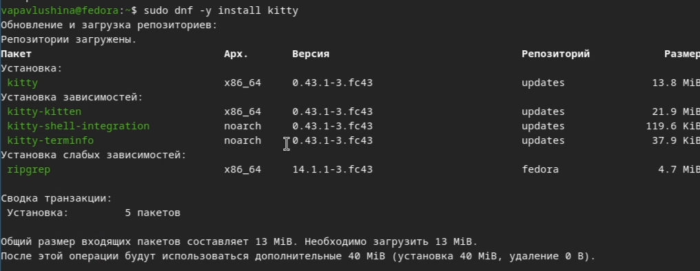{#fig:lab01-15} 
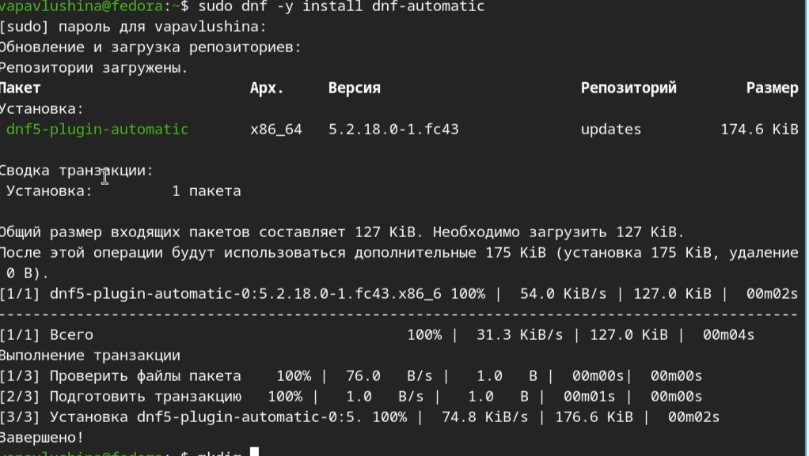{#fig:lab01-16}

Задаём конфигурацию в файле /etc/dnf/automatic.conf и запускаем таймер ([рис. @fig:lab01-17], [рис. @fig:lab01-18],[рис. @fig:lab01-19],[рис. @fig:lab01-20], [рис. @fig:lab01-21], [рис. @fig:lab01-22], [рис. @fig:lab01-23], [рис. @fig:lab01-24], [рис. @fig:lab01-25])

{#fig:lab01-17}
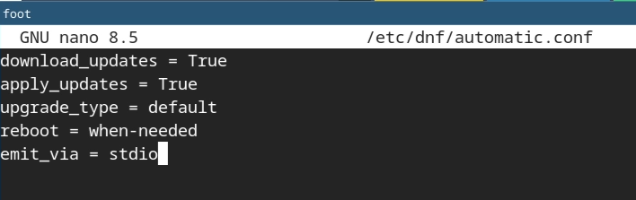{#fig:lab01-18}
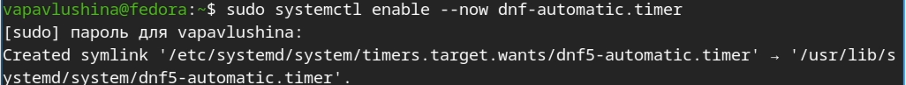{#fig:lab01-19}
{#fig:lab01-20}
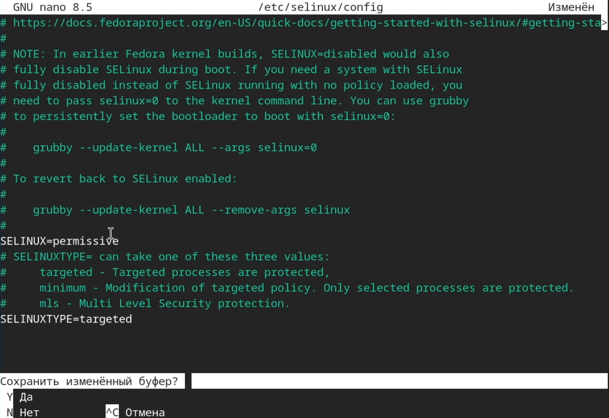{#fig:lab01-21}
{#fig:lab01-22}
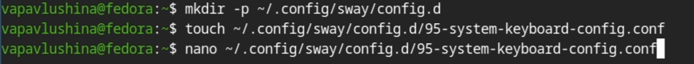{#fig:lab01-23}
{#fig:lab01-24}
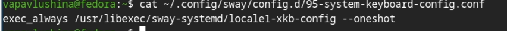{#fig:lab01-25}

Редактируем конфигурационный файл /etc/X11/xorg.conf.d/00-keyboard.conf ([рис. @fig:lab01-26, [рис. @fig:lab01-27])

{#fig:lab01-26}
{#fig:lab01-27}

Переходим в режим суперпользователя, обновляем пароль, устанавливаем имя хоста ([рис. @fig:lab01-28], [рис. @fig:lab01-29], [рис. @fig:lab01-30], [рис. @fig:lab01-31])

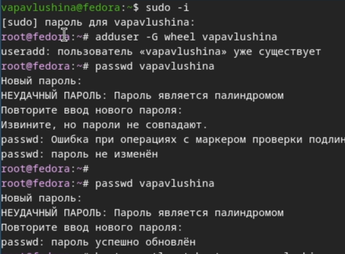{#fig:lab01-28}
{#fig:lab01-29}
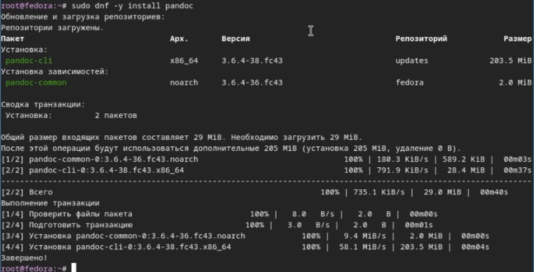{#fig:lab01-30}
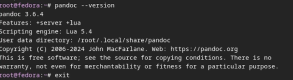{#fig:lab01-31}

Далее переходим в github и скачиваем нужную версию pandoc ([рис. @fig:lab01-32], [рис. @fig:lab01-33)

{#fig:lab01-32}
{#fig:lab01-33}

# **Выполнение домашней работы**

1) Получаем версию линукса и узнаем частоту процессора ([рис. @fig:lab01-34)
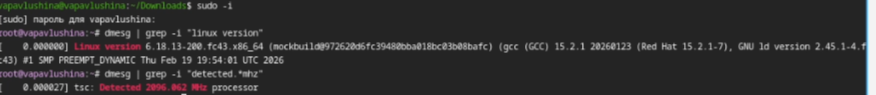{#fig:lab01-34}

2) Выводим данные о процессоре ([рис. @fig:lab01-35])
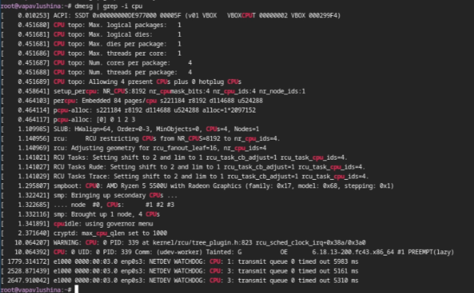{#fig:lab01-35}

3) Выводим информацию об использовании оперативной памяти ([рис. @fig:lab01-36)
{#fig:lab01-36}

4) Выводим информацию о гипервизоре ([рис. @fig:lab01-37)
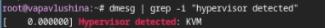{#fig:lab01-37}

5) Выводим информацию о типе файловой системы корневого раздела ([рис. @fig:lab01-38)
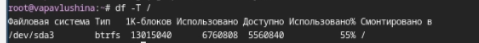{#fig:lab01-38}

6) Выводим информацию о последовательности монтирования файловых систем ([рис. @fig:lab01-39)
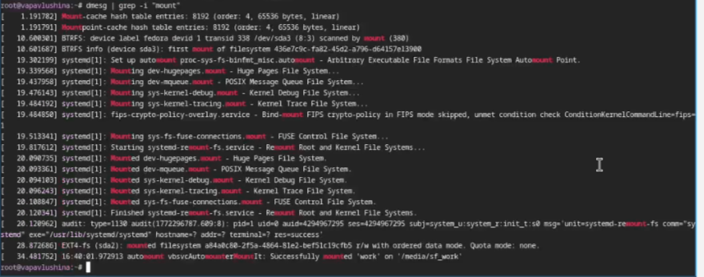{#fig:lab01-39}

# **Ответы на контрольные вопросы**
1. Учётная запись содержит данные для идентификации пользователя: имя, пароль, UID, GID, домашний каталог и командную оболочку shell.
2. 
  - Справка по команде: <команда> --help. Пример: ls --help.
  - Перемещение по файловой системе: cd <путь>. Пример: cd /home/user.
  - Просмотр содержимого файла: ls <файл>. Пример:ls -la (покажет все файлы и детали).
  - Определение объёма каталога: du -sh <каталог>. Пример: du -sh /home.
  - Создание/удаление каталогов: mkdir <имя> (создаст каталог), rmdir <имя> (удалит каталог, если он пустой), rm -r <имя> (удалит каталог с содержимым). Пример: mkdir -p books/tom 
  - Создание/удаление файлов: touch <файл> (создаст файл), rm <файл> (удалит файл). Пример: touch kitty, rm kitty
  - Задание прав на каталог/файл: chmod <права> <файл>. Пример: chmod 755 script.sh 
  - Просмотр истории: history

3.Файловая система - это способ организации и хранения данных на диске. Пример: ext4 - стандартная для Linux, NTFS - стандартная для Windows.
4.Чтобы посмотреть подмонтированный диск нужно: написать команду mount (покажет все подключённые системы), а затем df -h (покажет диски и место, в удобном для чтения виде).
5.Чтобы удалить зависший процесс нужно: найти PID процесса (ps aux | grep <имя_программы>), затем отправить сигнал завершения (kill <PID>).

# **Выводы**

Приобрела практические навыки установки операционной системы на виртуальную машину , настройки минимально необходимые для дальнейшей работы сервисов.

# **Список литературы**{.unnumbered}

- Dash
- P.Getting Started with Oracle VM VirtualBox

::: {#refs}
:::
