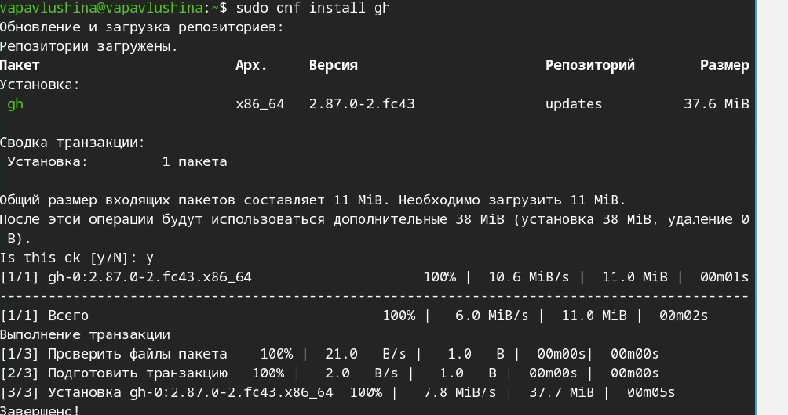
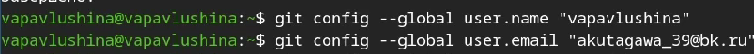
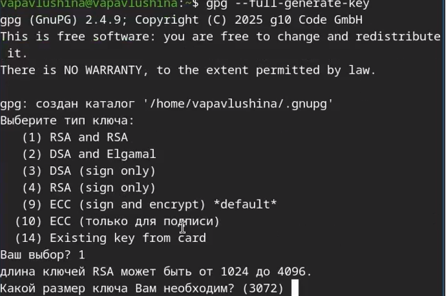
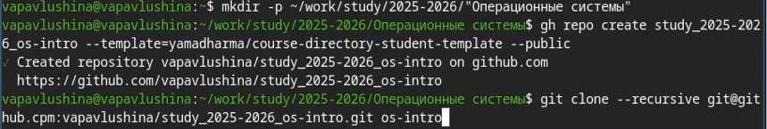

---
## Author
author:
  name: Павлушина Виктория Александровна
  group: НКАбд-05-25
  student-id: 1032253555
  email: 1032253555@pfur.ru
  affiliation:
    - name: Российский университет дружбы народов
      country: Российская Федерация
      city: Москва
      address: ул. Миклухо-Маклая, д. 6
## Title
title: Архитектура компьютеров и операционные системы
subtitle: Презентация для лабораторной работы №2
license: CC BY
date: 07.03.2026
date-format: "2026-03-07" 
---

# Информация

## Докладчик

:::::::::::::: {.columns align=center}
::: {.column width="70%"}

  * Павлушина Виктория Александровна
  * Студент
  * Направление подготовки: Компьютерные и информационные технологии
  * Российский университет дружбы народов им. П. Лумумбы
  * [1032253555@pfur.ru](mailto:1032253555@pfur.ru)
  * <https://github.com/vapavlushina>

:::
::: {.column width="30%"}

:::
::::::::::::::

# Вводная часть

## Актуальность
- Системы контроля версий — неотъемлемая часть современной разработки
- Git является стандартом де-факто в индустрии
- Правильная настройка инструментов экономит время и предотвращает ошибки

## Объект и предмет исследования

 Объект: системы контроля версий
- Предмет: первоначальная настройка Git и сопутствующих инструментов

  
## Цели и задачи

Цель:Изучить идеологию и применение средств контроля версий и освоить умения по работе с git.

Задания:
-Создать базовую конфигурацию для работы с git. 
-Создать ключ SSH.
-Создать ключ PGP.
-Настроить подписи git. 
-Зарегистрироваться на Github.
-Создать локальный каталог для выполнения заданий по предмету.

## Материалы и методы

- Git — система контроля версий
- GitHub — платформа для хостинга репозиториев
- Утилиты: ssh-keygen, gpg, gh
- Командная строка Linux

# Выполнение работы

## Установка программного обеспечения

Устанавливаем git и gh.
{#fig:01 width=70%}
{#fig:02 width=70%}

## Базовая настройка git

Устанавливаем имя пользователя и email.
{#fig:03 width=70%}

Настраиваем верификацию и подписание коммитов git.
{#fig:04 width=70%}
{#fig:05 width=70%}

## Создание ключа SSH
{#fig:06 width=70%}

## Создание ключа pgp
{#fig:07 width=70%}

## Настройка github
{#fig:08 width=70%}

## Добавляем pgp и ssh keys

{#fig:09 width=70%}
{#fig:10 width=70%}
{#fig:11 width=70%}
{#fig:12 width=70%}

## Настройка автоматических подписей коммитов git
{#fig:13 width=70%}

## Настройка gh
{#fig:14 width=70%}

## Шаблон для рабочего пространства
{#fig:15 width=70%}
{#fig:01 width=70%}
{#fig:16 width=70%}

# Выводы
Изучила идеологию и применение средств контроля версий и освоила умения по работе с git.

