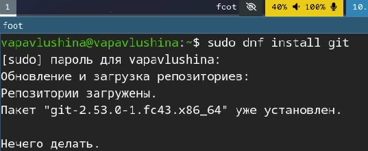
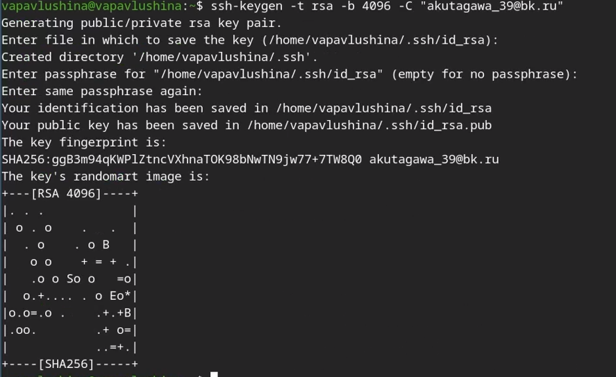
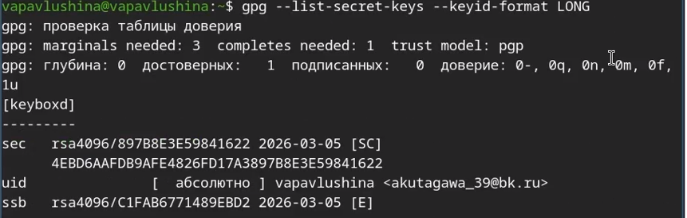
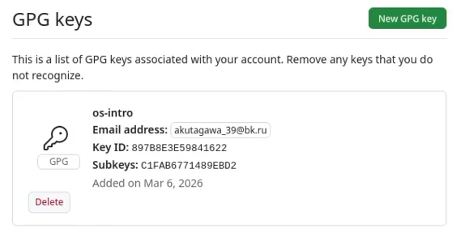
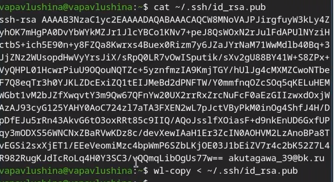
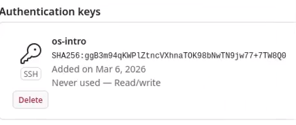
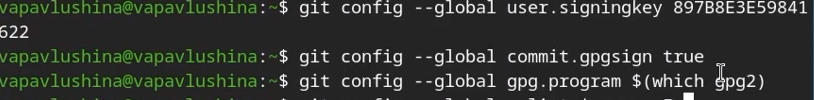
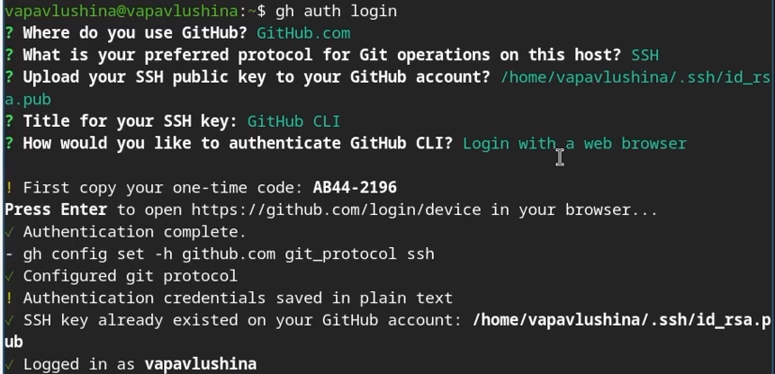
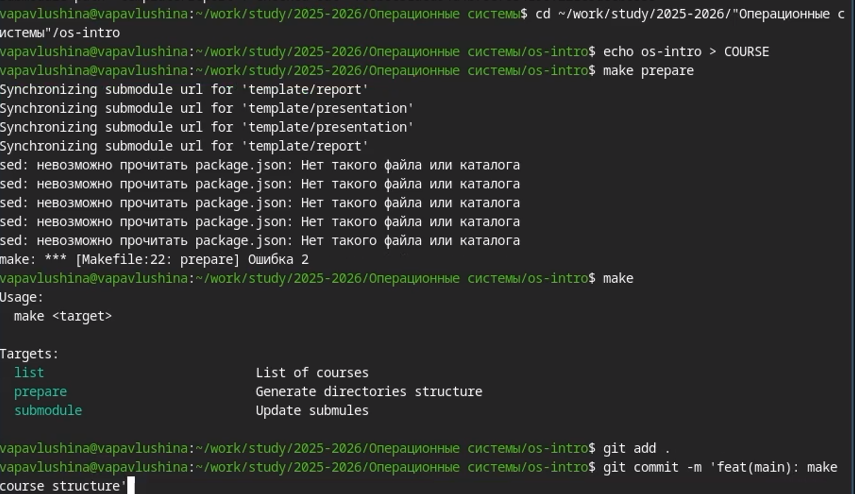
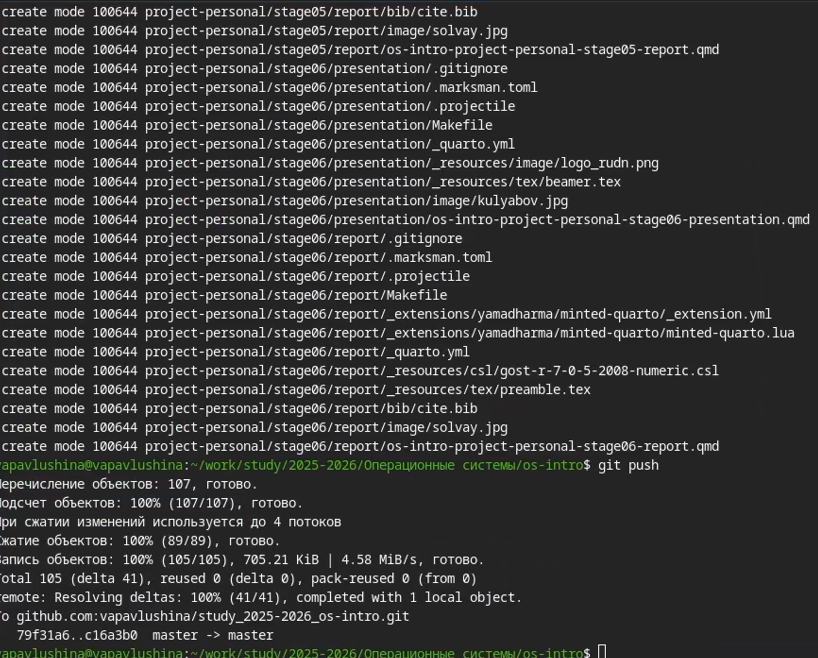

---
## Author
author:
  name: Павлушина Виктория Александровна
  group: НКАбд-05-25
  student-id: 1032253555
  email: akutagawa_39@bk.ru

  affiliation:
    - name: Российский университет дружбы народов
      country: Российская Федерация
      city: Москва
      address: ул. Миклухо-Маклая, д. 6

## Title
title: "Архитектура компьютеров и операционные системы"
subtitle: "Лабораторная работа №2"
license: "CC BY"
---

# Цель работы

Изучить идеологию и применение средств контроля версий и освоить умения по работе с git.

# Задания

-Создать базовую конфигурацию для работы с git.
-Создать ключ SSH.
-Создать ключ PGP.
-Настроить подписи git.
-Зарегистрироваться на Github.
-Создать локальный каталог для выполнения заданий по предмету.

# Теоретическое введение

Системы контроля версий нужны для работы нескольких человек над одним проектом. Обычно основное дерево проекта хранится в локальном или удалённом репозитории, к которому настроен доступ для участников проекта. При внесении изменений в содержание проекта система контроля версий позволяет их фиксировать, совмещать изменения, произведённые разными участниками проекта, производить откат к любой более ранней версии проекта, если это требуется.

# Выполнение лабораторной работы

## Установка программного обеспечения

Устанавливаем git ([рис. @fig:lab02-1]).
{#fig: lab02-1}

Устанавливаем gh ([рис. @fig:lab02-2]).
{#fig: lab02-2}

## Базовая настройка git

Задаём имя пользователя и email ([рис. @fig:lab02-3]).
{#fig: lab02-3}

Настраиваем utf-8 в выводе сообщений git ([рис. @fig:lab02-4]).
{#fig: lab02-4}

Настроим верификацию и подписание коммитов git. Для этого зададим имя начальной ветки ([рис. @fig:lab02-5]) и настроим параметры autocrlf, safecrlf ([рис. @fig:lab02-6]).
{#fig: lab02-5}
{#fig: lab02-6}

## Создание ключа ssh
Создадим по алгоритму rsa с ключом размером 4096 бит ([рис. @fig:lab02-7]).
{#fig: lab02-7}

## Создание ключа pgp
Генерируем ключ ([рис. @fig:lab02-8]).
{#fig: lab02-8}

## Настройка github
Создали учётную запись на github ([рис. @fig:lab02-9]).
{#fig: lab02-9}

## Добавление PGP ключа в GitHub
Выводим список ключей и копируем отпечаток приватного ключа ([рис. @fig:lab02-10], ([рис. @fig:lab02-11)).
{#fig: lab02-10}
{#fig: lab02-11}

Перейдём в настройки GitHub, нажмём на кнопку New GPG key и вставим полученный ключ в поле для ввода ([рис. @fig:lab02-12]).
{#fig: lab02-12}

## Добавление SSH ключа в GitHub
Для этого с помощью cat выедем отпечаток ключа SSH и скопируем его в буфер обмена ([рис. @fig:lab02-13]).
{#fig: lab02-13}

И вставим его в GitHub ([рис. @fig:lab02-14]).
{#fig: lab02-14}

## Настройка автоматических подписей коммитов git
Используя введённый email, укажем Git применять его при подписи коммитов ([рис. @fig:lab02-15]). 
{#fig: lab02-15}

## Настройка gh
Авторизуемся ([рис. @fig:lab02-16]). 
{#fig: lab02-16}

## Шаблон для рабочего пространства
Создадим репозиторий курса на основе шаблона ([рис. @fig:lab02-17]).
{#fig: lab02-17}

Настраиваем каталог курса. Перейдём в каталог курса, удалим лишние файлы и создадим необходимые каталоги ([рис. @fig:lab02-18]).
{#fig: lab02-18}

И теперь отправляем файлы на сервер ([рис. @fig:lab02-19]).
{#fig: lab02-19}

# Выводы

Изучила идеологию и применение средств контроля версий и освоила умения по работе с git.

# Контрольные вопросы 
1. Что такое системы контроля версий (VCS) и для решения каких задач они предназначаются? - VCS - это программные инструменты, которые отслеживают изменения в файлах и позволяют управлять историей этих изменений. Предназначены для хранения истории проекта, отката к старым версиям, совместной работы над одним проектом.
2. Объясните следующие понятия VCS и их отношения: хранилище, commit, история, рабочая копия. - Хранилищем является репозиторий, он хранит в себе все файлы проекта и историю их изменений. Commit - это фиксация измений файлов в проекте. История  - это журнал всех когда-либо сделанны коммитов, по которому можно перемещаться. Рабочая копия - это локальная версия файлов проекта, с которой пользователь работает в данный момент.
3. Что представляют собой и чем отличаются централизованные и децентрализованные VCS? Приведите примеры VCS каждого вида. - Централизованные VCS: есть одно главное хранилище на сервере. Работать без сети нельзя. Примеры: CVS. Десцентрализованные: у каждого разработчика на компьютере есть полная копия всего хранилища. Работать можно без интернета. Примеры: Git.
4. Опишите действия с VCS при единоличной работе с хранилищем. - Создать локальное хранилище(git init), создавать/редактировать файлы в рабочей папке, добавлять файлы в область подготовленных (git add), фиксировать изменения с комментарием(git commit), при необходимости можно просматривать историю (git log).
5. Опишите порядок работы с общим хранилищем VCS. - Получить актуальную версию из общего репозитория(git pull), внести свои изменения, отправить свои изменения в общее хранилище(git push), при необходимости можно будет сделать слияние изменений и после снова их отправить.
6. Каковы основные задачи, решаемые инструментальным средством git? - Отслеживание истории изменений, обеспечение одновременной работы нескольких разработчиков, управление ветками, синхронизация изменений между локальным и удалёнными репозиториями.
7. Назовите и дайте краткую характеристику командам git.
   - git init (создать новый репозиторий)
   - git clone (скопировать существующий репозиторий к себе)
   - git add (добавить файлы в индекс)
   - git commit (зафиксировать изменения)
   - git status (посмотреть состояние файлов)
   - git log (посмотреть историю коммитов)
   - git push (отправить коммиты в удалённый репозиторий)
   - git pull (скачать изменения из удалённого репозитория)
   - git branch (работа с ветками)
8. Приведите примеры использования при работе с локальным и удалённым репозиториями. - Локальный репозиторий: git init -> git add . -> git commit -m "comment" -> git log. Удалённый репозиторий: git clone <url>
-> git add . -> git commit -m "comment" -> git pull -> git push.
9. Что такое и зачем могут быть нужны ветви (branches). Ветви - это указатели на определённые коммиты, позволяющие вести параллельную разработку. Нужны, чтобы разрабатывать новые функции или исправлять ошибки изолированно.
10. Как и зачем можно игнорировать некоторые файлы при commit? - Нужно, чтобы случайно не закоммитить служебные или временные файлы ( с паролями, кэш итд). Для этого создаётся файл .gitignore, в котором прописываются шаблоны имен файлов/каталогов, которые Git должен игнорировать.

::: {#refs}
:::
