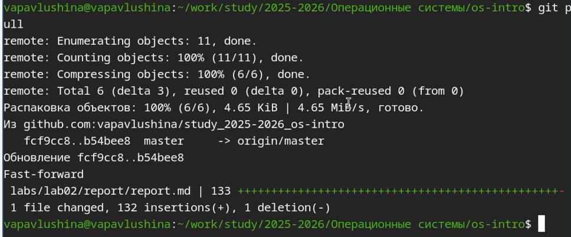
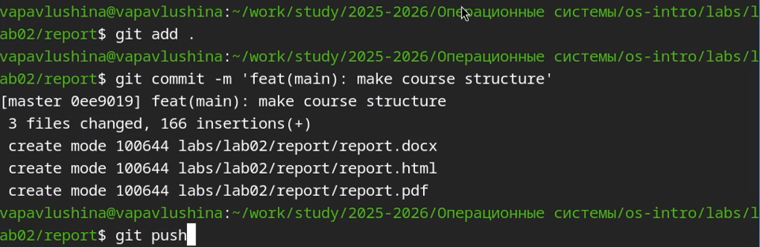

---
## Author
author:
  name: Павлушина Виктория Александровна
  group: НКАбд-05-25
  student-id: 1032253555
  email: 1032253555@pfur.ru
  affiliation:
    - name: Российский университет дружбы народов
      country: Российская Федерация
      city: Москва
      address: ул. Миклухо-Маклая, д. 6
## Title
title: Архитектура компьютеров и операционные системы
subtitle: Презентация для лабораторной работы №3
license: CC BY
date: 07.03.2026
date-format: "2026-03-07" 
---
# Информация

## Докладчик

:::::::::::::: {.columns align=center}
::: {.column width="70%"}

  * Павлушина Виктория Александровна
  * Студент
  * Направление подготовки: Компьютерные и информационные науки
  * Российский университет дружбы народов им. П. Лумумбы
  * [1032253555@pfur.ru](mailto:1032253555@pfur.ru)
  * <https://github.com/vapavlushina>

:::
::: {.column width="30%"}

:::
::::::::::::::

# Вводная часть

## Актуальность

## Объект и предмет исследования

- Объект: 
- Предмет: 

  
## Цели и задачи

Цель:Научиться оформлять отчёты с помощью легковесного языка разметки Markdown  

Задания:
- Оформить отчёт по предыдущей лабораторной работе с использованием синтаксиса Markdown.
- Готовый отчёт необходимо предоставить в трёх форматах: PDF, DOCX, MD . Файл следует упаковать в архив, поскольку он должен содержать скриншоты, Mikefile и другие сопутствующие материалы.

## Материалы и методы

- Markdown.

# Выполнение работы

# Выполнение лабораторной работы

Заранее сделав скриншоты, приступаю к выполнению лабораторной работы №3.

Создаю файл report.md и приступаю к редактированию.
{#fig:01 width=70%}

Открываю файл и начинаю редактировать в соответствии с шаблоном.
{#fig:02 width=70%}

Загружаю готовый отчёт в локальную репозиторий.
{#fig:03 width=70%}

Конвертирую своим спобосом в pdf.
{#fig:04 width=70%}

Конвертирую своим спобосом в docx.
{#fig:05 width=70%}

Отправляю готовые файлы на сервер.
{#fig:06 width=70%}

# Выводы

Научилась оформлять отчёты с помощью легковесного языка разметки Markdown.
