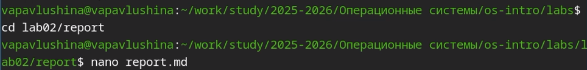
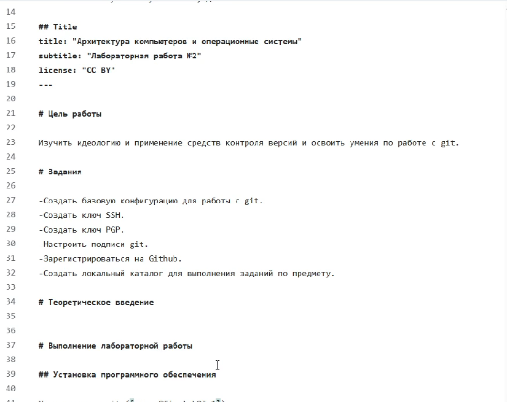
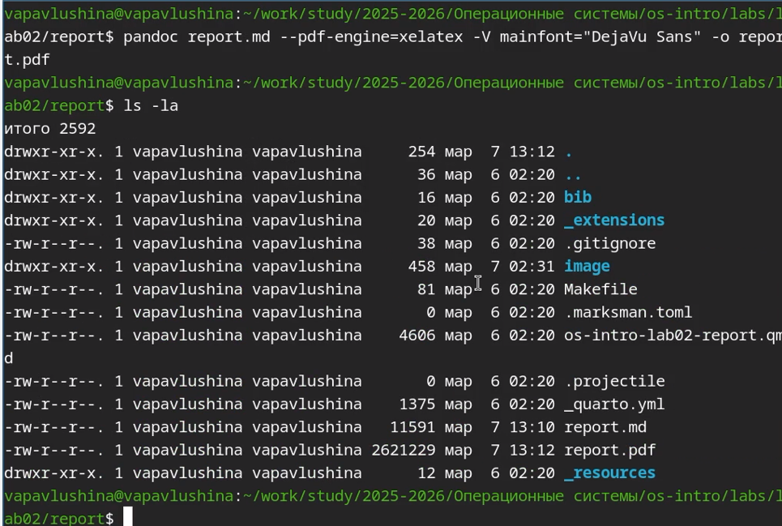
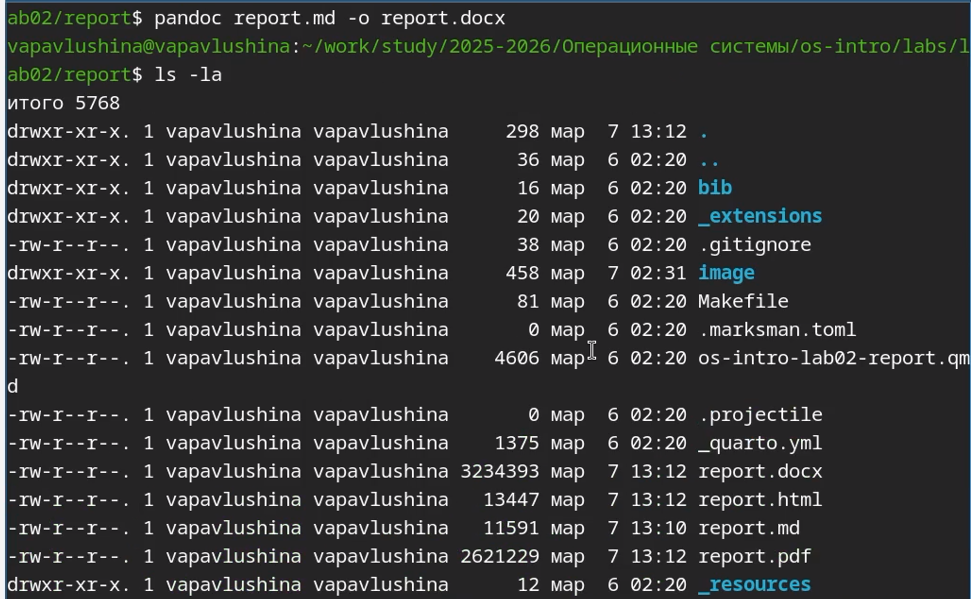

---
## Author
author:
  name: Павлушина Виктория Александровна
  degrees: Бакалавр
  orcid: 0000-0002-0877-7063
  email: 1032253555@pfur.ru
  affiliation:
    - name: Российский университет дружбы народов
      country: Российская Федерация
      postal-code: 117198
      city: Москва
      address: ул. Миклухо-Маклая, д. 6

## Title
title: "Архитектура компьютеров и операционные системы"
subtitle: "Лабораторная работа №3"
license: "CC BY"
---

# Цель работы

Научиться оформлять отчёты с помощью легковесного языка разметки Markdown  

# Задание

- Оформить отчёт по предыдущей лабораторной работе с использованием синтаксиса Markdown.
- Готовый отчёт необходимо предоставить в трёх форматах: PDF, DOCX, MD . Файл следует упаковать в архив, поскольку он должен содержать скриншоты, Mikefile и другие сопутствующие материалы.

# Теоретическое введение

При верстке отчета придерживайтесь следующих правил Markdown:

Заголовки создаются символом #.

Для выделения текста используйте двойные **жирный**, одинарные *курсив* и тройные ***жирный курсив*** звездочки.

Цитаты оформляются символом >.

Для списков используйте звездочки (*), дефисы (-) или нумерацию. Вложенные пункты создаются отступами.

Ссылки имеют формат [текст ссылки](имя_файла.md).

Код можно встраивать в текст или выносить в отдельные блоки.

Математические формулы вводятся согласно синтаксису LaTeX.
Для конвертации файлов используйте Pandoc (с расширениями pandoc-citeproc и pandoc-crossref). Примеры команд:

pandoc README.md -o README.pdf

pandoc README.md -o README.docx

Для автоматизации процесса сборки подготовьте Makefile со следующим содержимым:

FILES = $(patsubst %.md, %.docx, $(wildcard *.md))

FILES += $(patsubst %.md, %.pdf, $(wildcard *.md)

# Выполнение лабораторной работы

Заранее сделав скриншоты, приступаю к выполнению лабораторной работы №3.

Создаю файл report.md и приступаю к редактированию.
{#fig:1 width=70%}

Открываю файл и начинаю редактировать в соответствии с шаблоном.
{#fig:2 width=70%}

Загружаю готовый отчёт в локальную репозиторий.
{#fig:3 width=70%}

Конвертирую своим спобосом в pdf.
{#fig:4 width=70%}

Конвертирую своим спобосом в docx.
{#fig:5 width=70%}

Отправляю готовые файлы на сервер.
{#fig:6 width=70%}

# Выводы

Научилась оформлять отчёты с помощью легковесного языка разметки Markdown.

