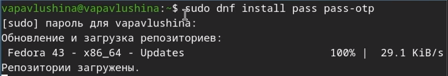
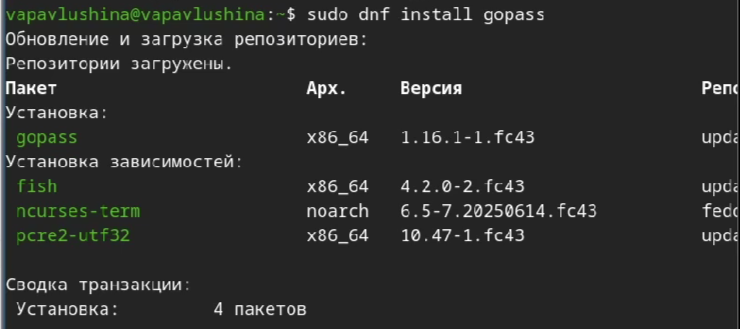
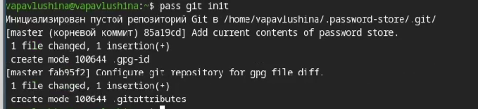
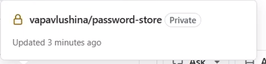
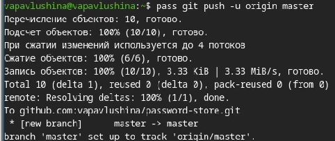
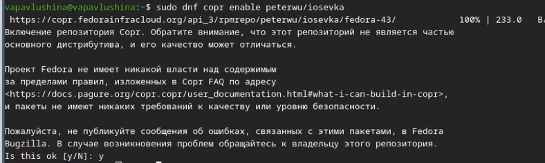
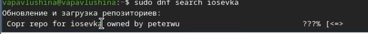
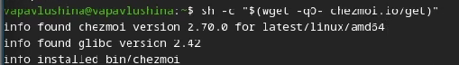

---
author:
  - name: "Павлушина Виктория Александровна"
    group: "НКАбд-05-25"
    email: "10322533555@pfur.ru"
    affiliation:
      - institution: "Российский университет дружбы народов"
        work: "Архитектура компьютеров и операционные системы"
        city: "Москва"
        country: "Россия"

title: "Лабораторная работа №5"
license: "CC BY 4.0"
date: "2026-03-14"


slide-level: 2
incremental: true
aspectratio: "169"
theme: "metropolis"
colortheme: "default"
fonttheme: "professionalfonts"

revealjs-url: "https://revealjs.com"
revealjs_theme: "beige"
transition: "slide"
width: 1200
height: 800
...


# Информация

## Докладчик

:::::::::::::: {.columns align=center}
::: {.column width="70%"}

* **Павлушина Виктория Александровна**
* Студент
* Факультет: Физико-математические и естественные науки
* Российский университет дружбы народов им. П. Лумумбы
* [1032253555@pfur.ru](mailto:1032253555@pfur.ru)

:::
::: {.column width="30%"}


:::
::::::::::::::

# Вводная часть
## Цель 
Целью данной лабораторной работы является настройка менеджера паролей pass с GPG шифрованием и синхронизацией через git, а также настройка управления конфигурационными файлами домашнего каталога с помощью утилиит chezmoi.

## Задачи 
1. Установить и настроить менеджер паролей pass и gopass.
2. Настроить синхронизацию хранилища паролей с репозиторием на GitHub.
3. Настроить интерфейс взаимодействия с браузером.
4. Установить дополнительное программное обеспечение и шрифты.
5. Установить chezmoi и создать репозиторий dotfiles.
6. Подключить репозиторий к системе и освоить ежедневные операции с chezmoi.


# Выполнение лабораторной работы

## Менеджер паролей pass

Установили pass и gopass 



Просмотрели секретные ключи


Инициализируем хранилище 


Теперь настроим синхронизацию с git. Создадим структуру git 


Создаём репозиторий **password-store**, а после задаём адрес репозитория на хостинге



## Настройка интерфейса с броузером

Скачиваем нужную программу 


Добавляем новый пароль 


Добавили изменения в удалённый репозиторий 



## Дополнительное программное обеспечение

Установим дополнительное программное обеспечение - ([рис. @fig:ris_15])
{#fig:ris_15 width=70%}

Установим шрифты 




Установка бинарного файла. Скрипт определяет архитектуру процессора и операционную систему и скачивает необходимый файл 


Cоздание собственного репозитория с помощью утилит.Создадим свой репозиторий для конфигурационных файлов на основе шаблона 


Инициализируем chezmoi с нашим репозиторием dotfiles 


Проверяем изменения 


## Ежедневные операции c chezmoi

Сохраняем изменения 


Обновляем chezmoi


# Выводы
В результате выполнения лабораторной работы настроила менеджер паролей pass с GPG шифрованием и синхронизацией через git, настроила управление конфигурационными файлами домашнего каталога с помощью утилиит chezmoi.

## Процессор `pandoc`

- Pandoc: преобразователь текстовых файлов
- Сайт: <https://pandoc.org/>
- Репозиторий: <https://github.com/jgm/pandoc>

## Формат `pdf`

- Использование LaTeX
- Пакет для презентации: [beamer](https://ctan.org/pkg/beamer)
- Тема оформления: `metropolis`

## Код для формата `pdf`

```yaml
slide_level: 2
aspectratio: 169
section-titles: true
theme: metropolis
