<!-- Титульный лист (начало) -->
\newpage
\thispagestyle{empty}

\begin{center}
\Large\textbf{РОССИЙСКИЙ УНИВЕРСИТЕТ ДРУЖБЫ НАРОДОВ} \\
\large\textit{Факультет физико-математических и естественных наук} \\[4cm]

\Huge\textbf{Архитектура компьютеров и операционные системы} \\[0.5cm]
\Large\textbf{<<Лабораторная работа №5>>} \\[1cm]
\large\textit{Дисциплина: Операционные системы} \\[3cm]

\begin{flushright}
\large
\textbf{Выполнилa:} \\
Павлушина В.А. \\
\textbf{Группа:} НКАбд-05-25 \\[1cm]
\end{flushright}

\vfill
\large\textit{Москва, 2025}
\end{center}

\newpage
\tableofcontents
\newpage
\listoffigures
\listoftables
\newpage
<!-- Титульный лист (конец) -->

# Цель работы

Целью данной лабораторной работы является настройка менеджера паролей pass с GPG шифрованием и синхронизацией через git, а также настройка управления конфигурационными файлами домашнего каталога с помощью утилиит chezmoi.

# 1. Задание

1. Установить и настроить менеджер паролей pass и gopass.
2. Настроить синхронизацию хранилища паролей с репозиторием на GitHub.
3. Настроить интерфейс взаимодействия с браузером.
4. Установить дополнительное программное обеспечение и шрифты.
5. Установить chezmoi и создать репозиторий dotfiles.
6. Подключить репозиторий к системе и освоить ежедневные операции с chezmoi.
   
# 2. Теоретическое введение

Рабочие файлы
Состояние файлов конфигурации сохраняется в каталоге

~/.local/share/chezmoi
Он является клоном вашего репозитория dotfiles.
Файл конфигурации ~/.config/chezmoi/chezmoi.toml (можно использовать также JSON или YAML) специфичен для локальной машины.
Файлы, содержимое которых одинаково на всех ваших машинах, дословно копируются из исходного каталога.
Файлы, которые варьируются от машины к машине, выполняются как шаблоны, обычно с использованием данных из файла конфигурации локальной машины для настройки конечного содержимого, специфичного для локальной машины.
При запуске
chezmoi apply
вычисляется желаемое содержимое и разрешения для каждого файла, а затем вносит необходимые изменения, чтобы ваши файлы соответствовали этому состоянию.

По умолчанию chezmoi изменяет файлы только в рабочей копии.

Пересоздание файл конфигурации
Если вы измените шаблон файла конфигурации, chezmoi предупредит вас, если ваш текущий файл конфигурации не был сгенерирован из этого шаблона.
Вы можете повторно сгенерировать файл конфигурации, запустив:
chezmoi init

Способы создания файла шаблона
При первом добавлении файла передайте аргумент --template:

chezmoi add --template ~/.zshrc
Если файл уже контролируется chezmoi, но не является шаблоном, можно сделать его шаблоном:

chezmoi chattr +template ~/.zshrc
Можно создать шаблон вручную в исходном каталоге, присвоив ему расширение .tmpl:

chezmoi cd
$EDITOR dot_zshrc.tmpl
Шаблоны в каталоге .chezmoitemplates должны создаваться вручную:

chezmoi cd
mkdir -p .chezmoitemplates
cd .chezmoitemplates
$EDITOR mytemplate

Редактирование файла шаблона
Используйте chezmoi edit:

chezmoi edit ~/.zshrc
Чтобы сделанные вами изменения сразу же применялись после выхода из редактора, используйте опцию --apply:

chezmoi edit --apply ~/.zshrc

# 3. Выполнение лабораторной работы

## 3.1 Менеджер паролей pass

Установили pass и gopass - рис. @fig:ris_1 и рис. @fig:ris_2 
{#fig:ris_1 width=70%}
{#fig:ris_2 width=70%}

Просмотрели секретные ключи - рис. @fig:ris_3
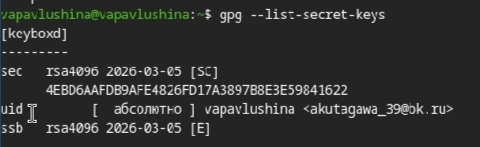{#fig:ris_3 width=70%}

Инициализируем хранилище - рис. @fig:ris_4
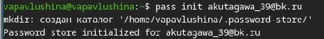{#fig:ris_4 width=70%}

Теперь настроим синхронизацию с git. Создадим структуру git - рис. @fig:ris_5
{#fig:ris_5 width=70%}

Создаём репозиторий **password-store** - рис. @fig:ris_6, а после задаём адрес репозитория на хостинге - рис. @fig:ris_7
{#fig:ris_6 width=70%}
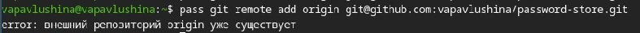{#fig:ris_7 width=70%}

## 3.2 Настройка интерфейса с броузером

Скачиваем нужную программу - рис. @fig:ris_10, рис. @fig:ris_11
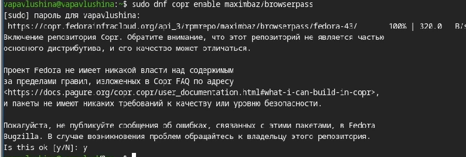{#fig:ris_10 width=70%}
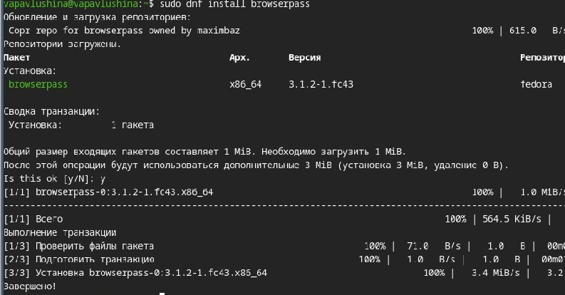{#fig:ris_11 width=70%}

Добавляем новый пароль - рис. @fig:ris_8
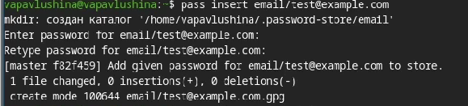{#fig:ris_8 width=70%}

Добавили изменения в удалённый репозиторий - рис. @gif:ris_9
{#fig:ris_9 width=70%}

## 3.3 Дополнительное программное обеспечение

Установим дополнительное программное обеспечение - рис. @fig:ris_15
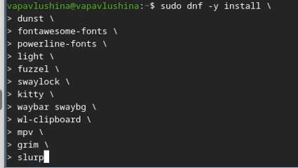{#fig:ris_15 width=70%}

Установим шрифты - рис. @fig:ris_12, рис. @fig:ris_13, рис.@fig:ris_14
{#fig:ris_12 width=70%}
{#fig:ris_13 width=70%}
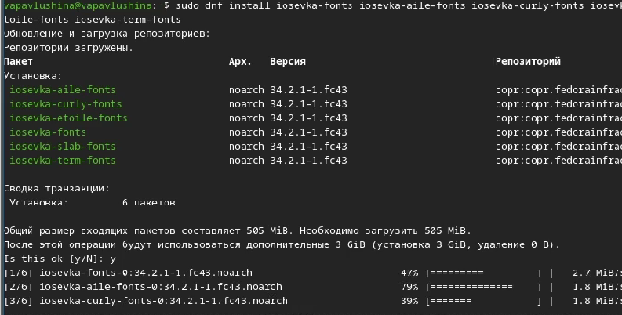{#fig:ris_14 width=70%}

Установка бинарного файла. Скрипт определяет архитектуру процессора и операционную систему и скачивает необходимый файл - рис. @fig:ris_16
{#fig:ris_16 width=70%}

Cоздание собственного репозитория с помощью утилит.Создадим свой репозиторий для конфигурационных файлов на основе шаблона - рис. @fig:ris_17
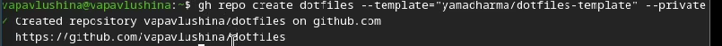{#fig:ris_17 width=70%}

Инициализируем chezmoi с нашим репозиторием dotfiles - рис. @fig:ris_18
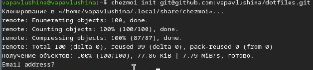{#fig:ris_18 width=70%}

Проверяем изменения - рис. @fig:ris_19
{#fig:ris_19 width=70%}

## 3.4 Ежедневные операции c chezmoi

Сохраняем изменения - рис. @fig:ris_20
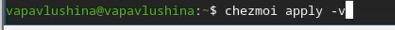{#fig:ris_20 width=70%}

Обновляем chezmoi - рис. @fig:ris_21
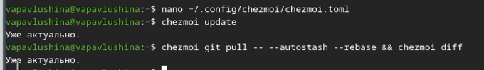{#fig:ris_21 width=70%}

# 4. Выводы
В результате выполнения лабораторной работы настроила менеджер паролей pass с GPG шифрованием и синхронизацией через git, настроила управление конфигурационными файлами домашнего каталога с помощью утилиит chezmoi.

