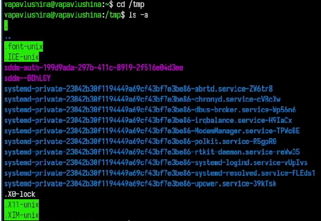
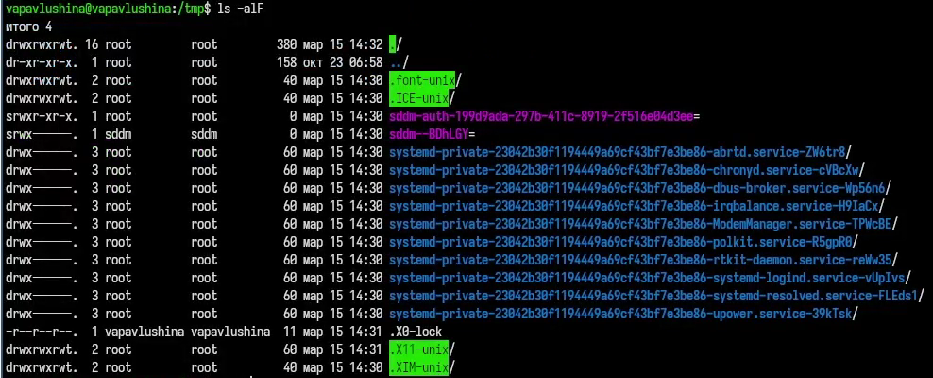
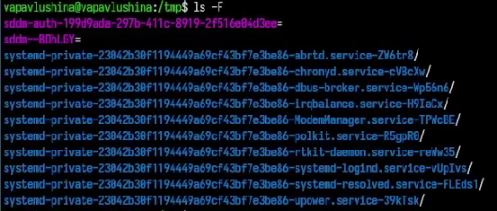
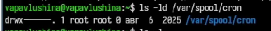
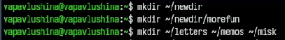
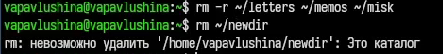
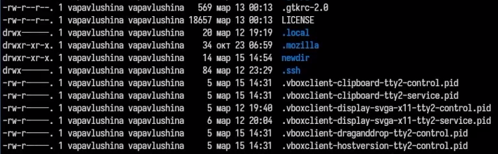
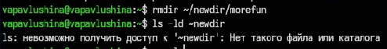
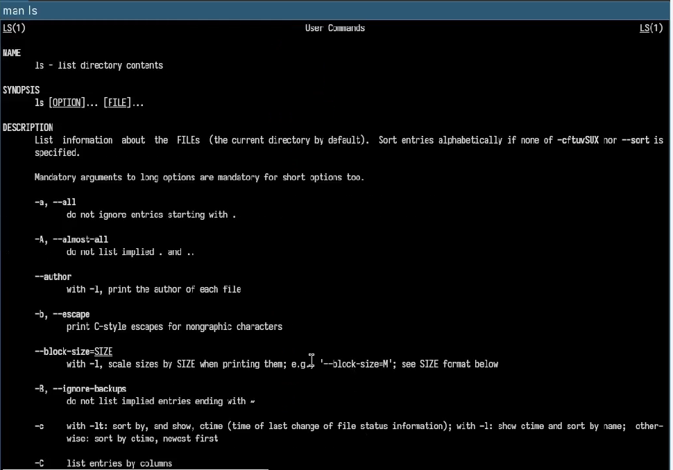
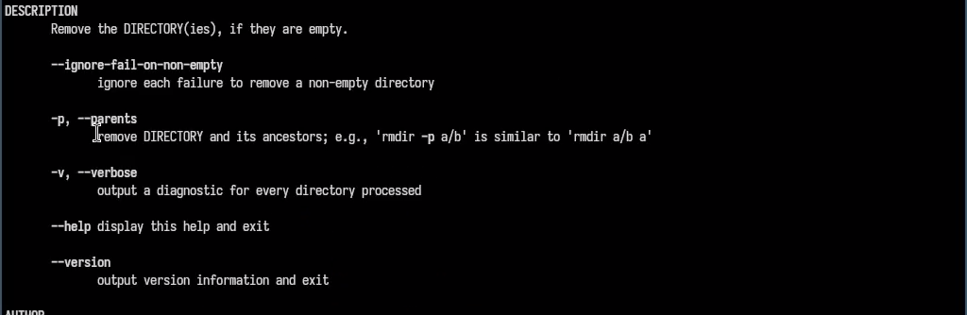

## i18n babel
babel-lang: russian
babel-otherlangs: english

## Formatting pdf
toc: false
toc-title: Содержание
slide_level: 2
aspectratio: 169
section-titles: true
theme: default
---

# Лабораторная работа №6

Операционные системы

Павлушина Виктория 16 мая 2026

Российский университет дружбы народов, Москва, Россия

---

# Информация

- Павлушина Виктория Александровна
- Студент НКАбд-05-25
- Российский Университет Дружбы Народов
- 1032253555@rudn.ru

---

# Цель работы

Приобретение практических навыков взаимодействия пользователя с системой посредством командной строки.

---

# Задание

1. Выполнить навигацию по файловой системе.
2. Получить справочную информацию.
3. Выполнить управление каталогами.
4. Сделать анализ содержания каталогов.
5. Работа с history.
6. Комбинировать команды.

---

# Теоретическая часть

Команда **man** используется для просмотра (оперативная помощь) в диалоговом режиме руководства (manual) по основным командам операционной системы типа Linux.

Формат команды: `man <команда>`

Команда **cd** используется для перемещения по файловой системе операционной системы типа Linux.

Формат команды: `cd [путь_к_каталогу]`

Команда **pwd**. Для определения абсолютного пути к текущему каталогу используется команда pwd (print working directory).

---

Команда **ls**. Команда ls используется для просмотра содержимого каталога.

Формат команды: `ls [-опции] [путь]`

Команда **mkdir**. Команда mkdir используется для создания каталогов.

Формат команды: `mkdir имя_каталога1 [имя_каталога2...]`

Команда **rm**. Команда rm используется для удаления файлов и/или каталогов.

Формат команды: `rm [-опции] [файл]`

Команда **history**. Для вывода на экран списка ранее выполненных команд используется команда history. Выводимые на экран команды в списке нумеруются. К любой команде из выведенного на экран списка можно обратиться по её номеру в списке, воспользовавшись конструкцией !<номер_команды>.

---

# Выполнение лабораторной работы

Просмотрим название нашей домашней папки (рис. 1).

Рис. 1: Название домашней папки

---

Перейдём в каталог tmp и посмотрим его содержимое с помощью команды ls и опции -a (рис. 2).

Рис. 2: Просмотр содержимого каталога tmp с опцией -a

---

Посмотрим содержимое tmp, используя другие опции ls (рис. 3).

Рис. 3: Использование опции -alF

---

Посмотрим содержимое tmp с опцией -F (рис. 4).

Рис. 4: Использование опции -F

---

Посмотрим содержимое tmp с опцией -l (рис. 5).

Рис. 5: Использование опции -l

Какая же разница в выводе информации через разные опции?

- `-a` - выводит все файлы, включая скрытые
- `-l` - выводит подробный список файлов
- `-F` - выводит информацию с символами-указателями, чтобы сразу понять тип файла
- `-alF` - включает в себя все предыдущие опции

---

Определим, есть ли в каталоге /var/spool подкаталог cron (рис. 6).

Рис. 6: Проверка наличия подкаталога cron

---

Перейдём в домашний каталог и выведем его содержимое (рис. 7).

Рис. 7: Содержимое домашнего каталога

---

Создали каталог newdir и в нём подкаталог morefun, также были созданы каталоги letters, memos, misk (рис. 8).

Рис. 8: Создание каталогов и подкаталогов

---

Удалили каталоги letters, memos, misk, попробовали удалить каталог newdir с помощью команды rm (рис. 9).

Рис. 9: Удаление каталогов

---

Проверим, что каталог newdir не удалился (рис. 10).

Рис. 10: Проверка

---

Удалим каталог newdir с подкаталогом morefun с помощью команды rm -r (рис. 11).

Рис. 11: Удаление каталога newdir

---

## Справочная информация

Вывели информацию о команде ls с помощью man (рис. 12).

Рис. 12: Информация о команде ls

---

Вывели информацию о команде cd с помощью man (рис. 13).

Рис. 13: Информация о команде cd

---

Вывели информацию о команде pwd с помощью man (рис. 14).

Рис. 14: Информация о команде pwd

---

Вывели информацию о команде mkdir с помощью man (рис. 15).

Рис. 15: Информация о команде mkdir

---

Вывели информацию о команде rmdir с помощью man (рис. 16).

Рис. 16: Информация о команде rmdir

---

Вывели информацию о команде rm с помощью man (рис. 17).

Рис. 17: Информация о команде rm

---

## History

Вывели информацию о последних командах с помощью команды history (рис. 18).

Рис. 18: Вывод списка history (часть 1)

---

Вывели информацию о последних командах с помощью команды history (рис. 19).

Рис. 19: Вывод списка history (часть 2)

---

## Комбинирование команд

Комбинируем команды (рис. 20).

Рис. 20: Вывод команды по её номеру

---

Вывели команду, введя её номер и заменив опцию (рис. 21).

Рис. 21: Модификация команды из history

---

# Выводы

Приобрела практические навыки взаимодействия пользователя с системой посредством командной строки.
