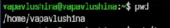
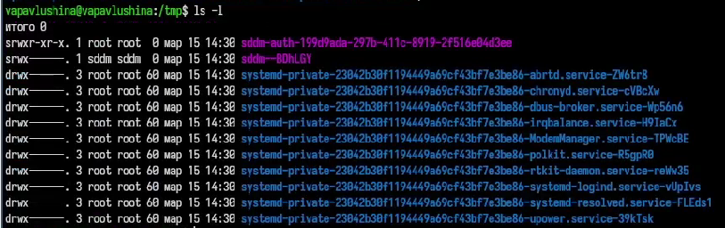
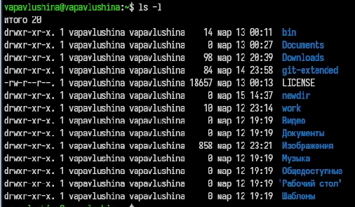
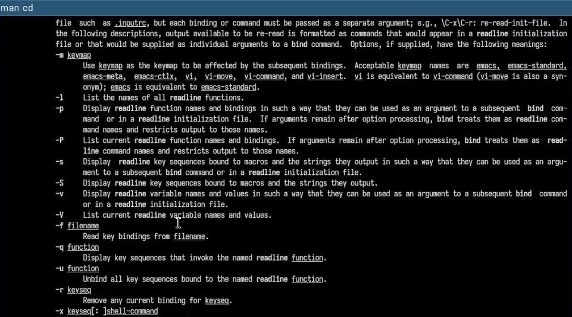
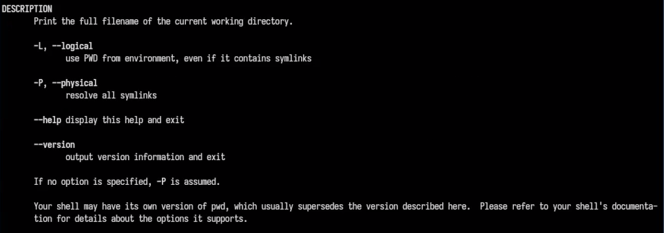
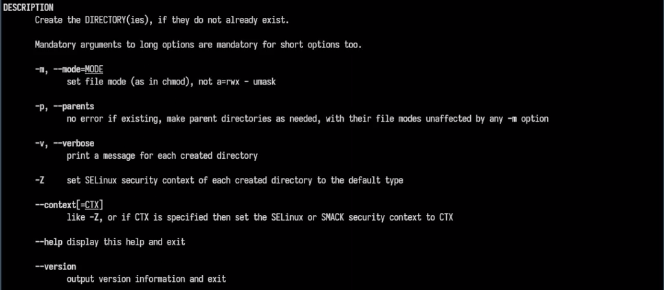
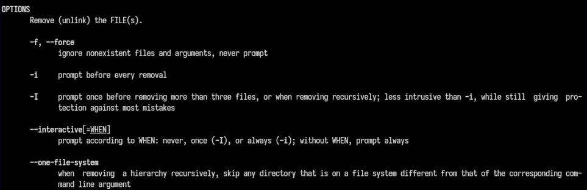
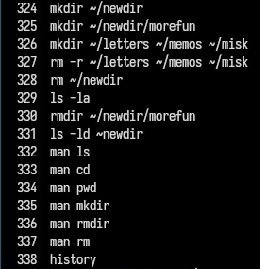
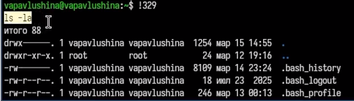

---
## Front matter
title: "Архитектура компьютеров и операционные системы"
subtitle: "Лабораторная работа №6"
author: "Павлушина В.А."

## Generic otions
lang: ru-RU
toc-title: "Содержание"

## Bibliography
bibliography: bib/cite.bib
csl: pandoc/csl/gost-r-7-0-5-2008-numeric.csl

## Pdf output format
toc: true # Table of contents
toc-depth: 2
lof: true # List of figures
lot: true # List of tables
fontsize: 12pt
linestretch: 1.5
papersize: a4
documentclass: scrreprt
## I18n polyglossia
polyglossia-lang:
  name: russian
  options:
    - spelling=modern
    - babelshorthands=true
polyglossia-otherlangs:
  name: english
## I18n babel
babel-lang: russian
babel-otherlangs: english
## Fonts
mainfont: Liberation Serif
romanfont: Liberation Serif
sansfont: Liberation Sans
monofont: Liberation Mono
mathfont: STIX Two Math
mainfontoptions: Ligatures=Common,Ligatures=TeX,Scale=0.94
romanfontoptions: Ligatures=Common,Ligatures=TeX,Scale=0.94
sansfontoptions: Ligatures=Common,Ligatures=TeX,Scale=MatchLowercase,Scale=0.94
monofontoptions: Scale=MatchLowercase,Scale=0.94,FakeStretch=0.9
mathfontoptions:
## Biblatex
biblatex: true
biblio-style: "gost-numeric"
biblatexoptions:
  - parentracker=true
  - backend=biber
  - hyperref=auto
  - language=auto
  - autolang=other*
  - citestyle=gost-numeric
## Pandoc-crossref LaTeX customization
figureTitle: "Рис."
tableTitle: "Таблица"
listingTitle: "Листинг"
lofTitle: "Список иллюстраций"
lotTitle: "Список таблиц"
lolTitle: "Листинги"
## Misc options
indent: true
header-includes:
  - \usepackage{indentfirst}
  - \usepackage{float} # keep figures where there are in the text
  - \floatplacement{figure}{H} # keep figures where there are in the text
---

# Цель работы

Приобретение практических навыков взаимодействия пользователя с системой посредством командной строки.

# Задание

1.Выполнить навигацию по файловой системе.
2.Получить справочную информацию.
3.Выполнить управление каталогами.
4.Сделать анализ содержания каталогов.
5.Работа с history.
6.Комбинировать команды.

# Теоретическое введение

Команда **man** используется для просмотра (оперативная помощь) в диалоговом режиме руководства (manual) по основным командам операционной системы
типа Linux.
Формат команды:
`man <команда>`

Команда **cd** используется для перемещения по файловой системе операционной системы типа Linux.
Формат команды:
`cd [путь_к_каталогу]`

Команда **pwd**. Для определения абсолютного пути к текущему каталогу используется
команда *pwd* (print working directory).

Команда **ls**. Команда *ls* используется для просмотра содержимого каталога.
Формат команды:
`ls [-опции] [путь]`

Команда **mkdir**. Команда *mkdir* используется для создания каталогов.
Формат команды:
`mkdir имя_каталога1 [имя_каталога2...]`

Команда **rm**. Команда *rm* используется для удаления файлов и/или каталогов.
Формат команды:
`rm [-опции] [файл]`

Команда **history**. Для вывода на экран списка ранее выполненных команд используется команда history. Выводимые на экран команды в списке нумеруются. К любой
команде из выведенного на экран списка можно обратиться по её номеру в списке,
воспользовавшись конструкцией !<номер_команды>.

# Выполнение лабораторной работы

## Навигация по каталогам и работа с ними

Просмотрим название нашей домашней папки (рис. -@fig:001).
{#fig:001 width=70%}

Перейдём в каталог *tmp* и посмотрим его содержимое с помощью команды *ls* и опции *-а* (рис. -@fig:002).
{#fig:002 width=70%}

Посмотрим содержимое *tmp*, используя другие опции **ls** (рис. -@fig:003), (рис. -@fig:004), (рис. -@fig:005).
{#fig:003 width=70%}
{#fig:004 width=70%}
{#fig:005 width=70%}

Какая же разница в выводе информации через разные опции?
`-a` - выводит все файлы, включая скрытые 
`-l` - выводит подробный список файлов
`-F` - выводит информацию с символами-указателями, чтобы сразу понять тип файла
`-alF` - включает в себя все предыдущие опции 

Определим, есть ли в каталоге */varn/spool* подкаталог *cron* (рис. -@fig:006).
{#fig:006 width=70%}

Перейдём в домашний каталог и выведем его содержимое (рис. -@fig:007).
{#fig:007 width=70%}

Создали каталог *newdir* и в нём подкаталог *morefun*, также были созданы каталоги *letters*, *memos*., *misk* (рис. -@fig:008).
{#fig:008 width=70%}

Удалили каталоги *letters*, *memos*., *misk*, попробовали удалить каталог *newdir* с помощью команды **rm** (рис. -@fig:009).
{#fig:009 width=70%}

Проверим, что каталог newdir не удалился (рис. -@fig:010).
{#fig:010 width=70%}

Удалим каталог *newdir* с подкаталогом *morefun* с помощью команды **mrdir** (рис. -@fig:011).
{#fig:011 width=70%}

## Справочная информация

Вывели информацию о команде **ls** с помощью **man** (рис. -@fig:012), (рис. -@fig:013).
{#fig:012 width=70%}
{#fig:013 width=70%}

Вывели информацию о команде **cd** с помощью **man** (рис. -@fig:014), (рис. -@fig:015).
{#fig:014 width=70%}
{#fig:015 width=70%}

Вывели информацию о команде **pwd** с помощью **man** (рис. -@fig:016), (рис. -@fig:017).
{#fig:016 width=70%}
{#fig:017 width=70%}

Вывели информацию о команде **mkdir** с помощью **man** (рис. -@fig:018), (рис. -@fig:019).
{#fig:018 width=70%}
{#fig:019 width=70%}

Вывели информацию о команде **rmdir** с помощью **man** (рис. -@fig:020), (рис. -@fig:021).
{#fig:020 width=70%}
{#fig:021 width=70%}

Вывели информацию о команде **rm** с помощью **man** (рис. -@fig:022), (рис. -@fig:023).
{#fig:022 width=70%}
{#fig:023 width=70%}

## History

Вывели информацию о последних командах с помощью команды **history** (рис. -@fig:024), (рис. -@fig:025).
{#fig:024 width=70%}
{#fig:025 width=70%}

## Комбинирование команд 

Комбинируем команды (рис. -@fig:026), (рис. -@fig:027).
{#fig:025 width=70%}
{#fig:026 width=70%}

# Выводы

Приобрела практические навыки взаимодействия пользователя с системой посредством командной строки.

# Контрольные вопросы 

1.**Командная строка** - это текстовый интерфейс для управление системой через ввод команд.
2.**Абсолютный путь текущего каталога** - можно найти при помощи команды *pwd*.
3.**Определение типа файлов и их имена** - можно просмотреть при помощи команды *ls -F*.
4.**Показать скрытые файлы** можно при помощи команды *ls -a*.
5.**Удаление файла или каталога** :
  - *rm* удаляет файл
  - *rmdir* удаляет каталог
  - *rm -r* удаляет каталог с содержимым
6.**Историю команд** можно просмотреть с помощью команды *history*.
7.**Модифицированное выполнение из истории** :
    - !! повторить последнюю команду
    - !<номер команды в списке> - выполнить команду с введённым номером в списке
    - !<номер команды в списке>:s/<Что заменить>/<На что заменить>
8.**Пример:**
    `cd test; ls`
9.**Экранирование** - отмена служебного значения символа с помощью "\".
Пример: `cat Downloads/homework.txt `
10.**Вывод ls -l** - подробный список(права, ссылки, владелец, размер, дата, имя).
11.**Относительный путь** - путь от текущей папки.
12.**Информация о команде** - производится с помощью команды *man*.
13.**Для автоматического дополнения вводимых команд** используется клавиша `Tab`.

::: {#refs}
:::
