---
## Front matter
title: "Внешний курс"
subtitle: "Раздел 3"
author: "Павлушина В.А."

## Generic otions
lang: ru-RU
toc-title: "Содержание"

## Bibliography
bibliography: bib/cite.bib
csl: pandoc/csl/gost-r-7-0-5-2008-numeric.csl

## Pdf output format
toc: true
toc-depth: 2
lof: true
lot: true
fontsize: 12pt
linestretch: 1.5
papersize: a4
documentclass: scrreprt
## I18n polyglossia
polyglossia-lang:
  name: russian
  options:
    - spelling=modern
    - babelshorthands=true
polyglossia-otherlangs:
  name: english
## I18n babel
babel-lang: russian
babel-otherlangs: english
## Fonts
mainfont: Iosevka
romanfont: Iosevka
sansfont: Iosevka
monofont: Iosevka
mathfont: STIX Two Math
mainfontoptions: Ligatures=Common,Ligatures=TeX,Scale=0.94
romanfontoptions: Ligatures=Common,Ligatures=TeX,Scale=0.94
sansfontoptions: Ligatures=Common,Ligatures=TeX,Scale=MatchLowercase,Scale=0.94
monofontoptions: Scale=MatchLowercase,Scale=0.94,FakeStretch=0.9
mathfontoptions:
## Biblatex
biblatex: true
biblio-style: "gost-numeric"
biblatexoptions:
  - parentracker=true
  - backend=biber
  - hyperref=auto
  - language=auto
  - autolang=other*
  - citestyle=gost-numeric
## Pandoc-crossref LaTeX customization
figureTitle: "Рис."
tableTitle: "Таблица"
listingTitle: "Листинг"
lofTitle: "Список иллюстраций"
lotTitle: "Список таблиц"
lolTitle: "Листинги"
## Misc options
indent: true
header-includes:
  - \usepackage{indentfirst}
  - \usepackage{float}
  - \floatplacement{figure}{H}
---

# Цель работы
Написание отчёта по выполнению 3 этапа внешнего курса "Введение в Linux".

# Задание

Просмотреть видео и на основе полученной информации пройти тестовые и интерактивные задания.

# Теоретическое введение

Linux — семейство свободных операционных систем с открытым исходным кодом, основанных на ядре Linux, разработанном Линусом Торвальдсом. Относится к Unix-подобным операционным системам.

# Выполнение подраздела 3.1 Текстовый редактор vim

" : ", затем "q", затем "Еnter" - в vim мы по умолчанию находимся в нормальном режиме, но чтобы выполнить команду выхода, нужно перейти в командный режим с помощью ":", затем ввести "q" и нажать Enter. Просто q или Q не сработают, так как они либо ничего не делают в нормальном режиме, либо переключают режим.
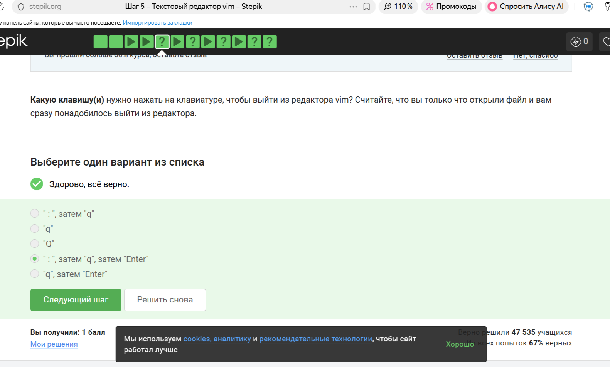{fig: 001 width=70%}

В этой строке 5 "больших слов" (WORD) - это верно.
Чтобы попасть в конец строки, нужно одинаковое число нажатий, что на W, что на w - неверно. 
Чтобы попасть в конец строки, нужно совершить меньше нажатий на W, чем на w - верно. W нужно 5 раз, а w - 9 или больше.
После 10 нажатий на W курсор окажется там же, где бы он был после 10 нажатий на w - верно. 
В этой строке 5 "слов" (word) - неверно, 9 слов.
Чтобы попасть в конец строки, нужно совершить больше нажатий на W, чем на w - неверно. Меньше, а не больше.
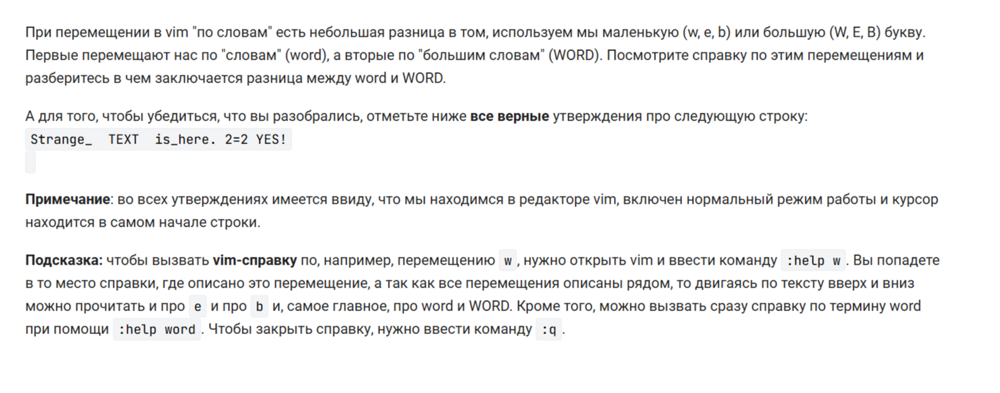{fig: 002 width=70%}
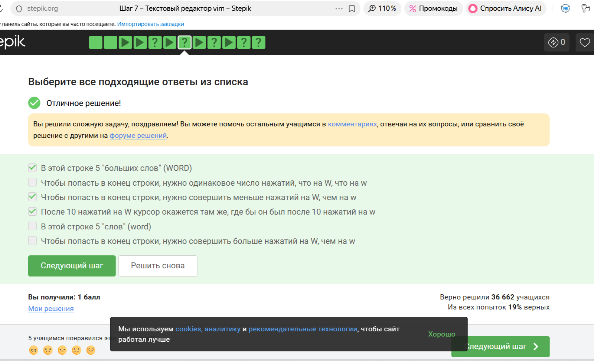{fig: 003 width=70%}

xxxxxxxxwywPp - верно. 8 раз х, удаляет one two. Остаётся three four five. Затем wywPp копирует и вставляет four. Получаем three four four four five.
d2wwywPp - d2w удаляет one two, w идёт на four, yw копирует four. Pp вставляет дважды - Получаем three four four four five.
d2w$bifour four <<Esc>> - d2w удаляет one two, $b идёт в конец и назад на four. i вставляет four four перед последним four.  <<Esc>> - не несёт смысла. Получаем three four four four five.
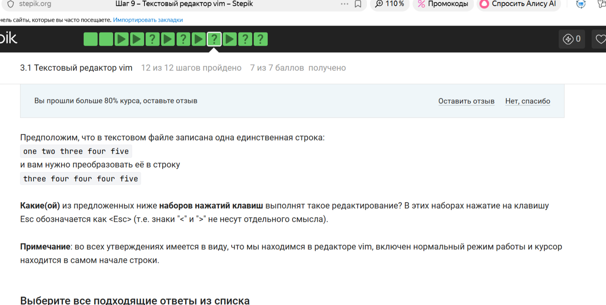{fig: 004 width=70%}
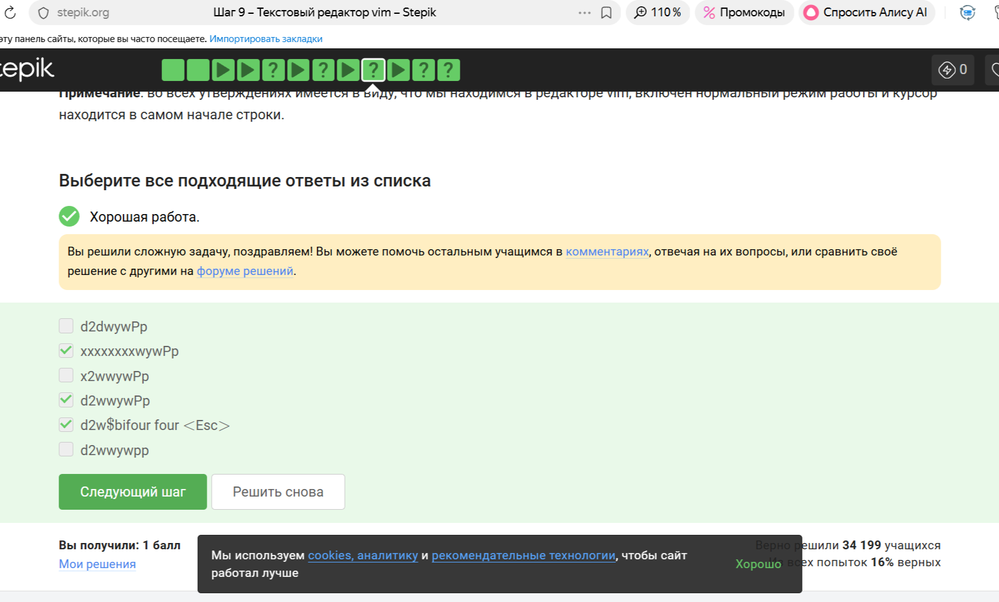{fig: 005 width=70%}

:%s/Windows/Linux/ - верный ответ. 
: - переход в командный режим.
% - применить ко всем строкам файла.
s/Windows/Linux/ - замена первого вхождения Windows на Linux  в каждой строке.
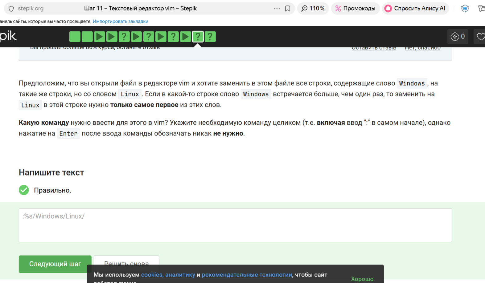{fig: 006 width=70%}

Когда вы находитесь в режиме выделения, внизу редактора горит надпись -- VISUAL -- (или -- ВИЗУАЛЬНЫЙ РЕЖИМ --) - верно. В статусной строке Vim всегда отображается текущий режим, а для визуального режима это будет -- VISUAL --.
В режиме выделения можно использовать команды перемещения (например, W, e, $, и др.) - верно. Весь смысл визуального режима в том, чтобы выделять текст, перемещая курсор с помощью любых навигационных команд.
Режим выделения открывается из нормального режима по нажатию "v" - верно. Это основной способ войти в символьный визуальный режим.
Выйти из режима выделения можно, нажав клавишу Esc два раза - верно.
Остальные утверждения ошибочны.
Чтобы выйти из режима выделения, нужно ввести :q - неверно. :q - это команда командной строки для закрытия файла целиком.
Режим выделения открывается из любого другого режима по нажатию "v" - неверно. Переключаться между режимами в Vim можно не всегда произвольно.
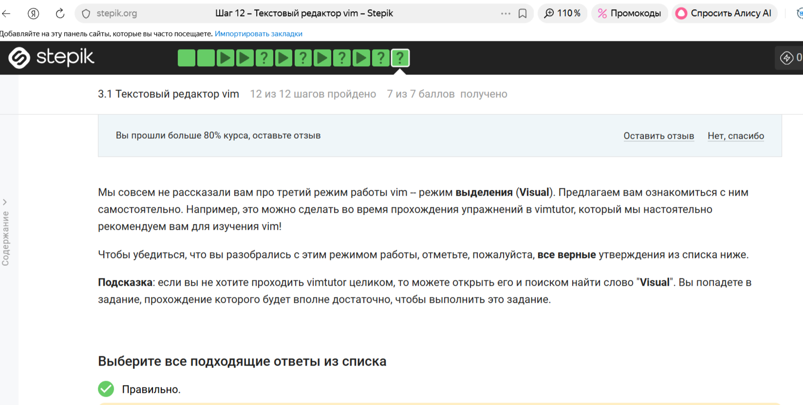{fig: 007 width=70%}
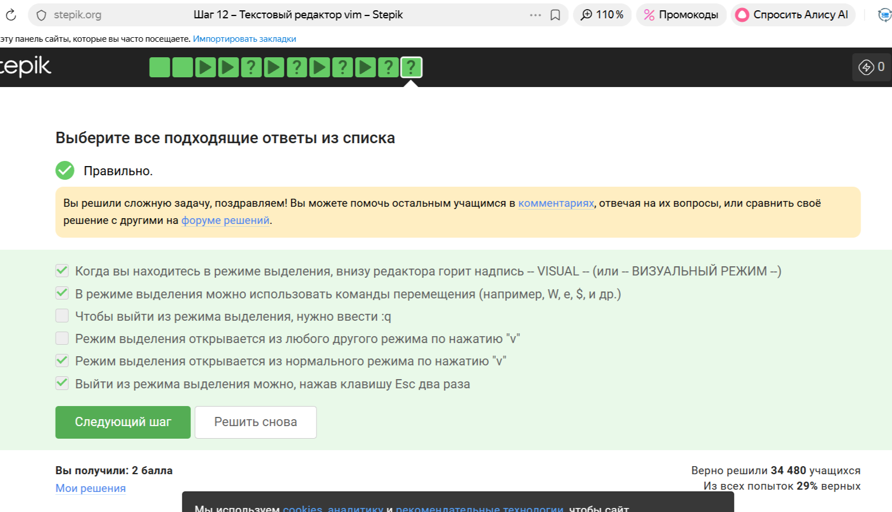{fig: 008 width=70%}

# Выполнение подраздела 3.2 Скрипты на bash: основы

Только из набора С 0 это верно. История команд не передаётся между разными процессами оболочекб даже если один запущен из другого. Поэтому последний bash выводит только те команды, которые в нём набрали - C1,C2,C3.
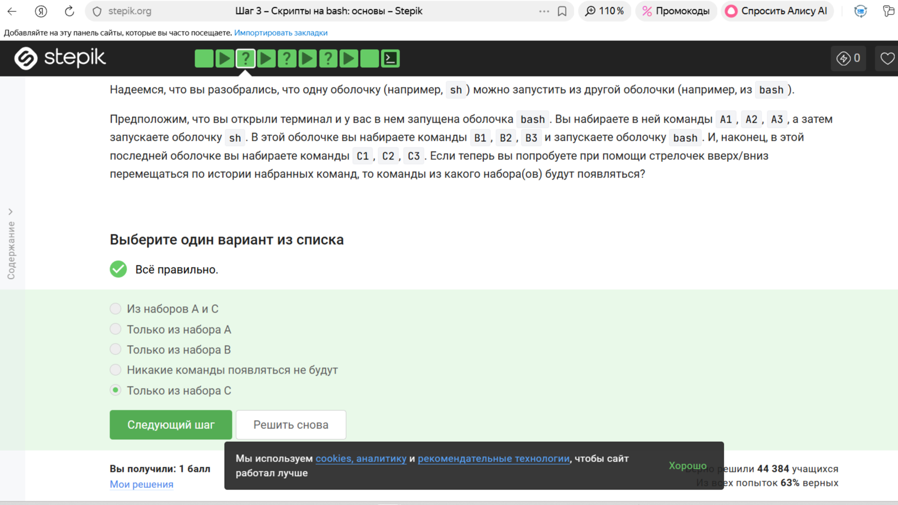{fig: 009 width=70%}

/home/bi/file1.txt - верно. Команда touch file1.txt не использует абсолютный путь, поэтому мы создаём файл в директории /home/bi/.
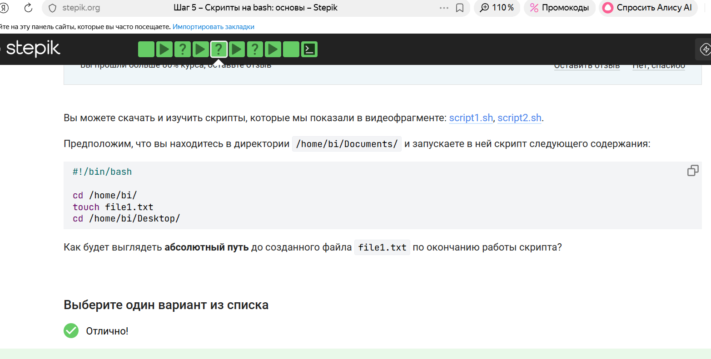{fig: 010 width=70%}
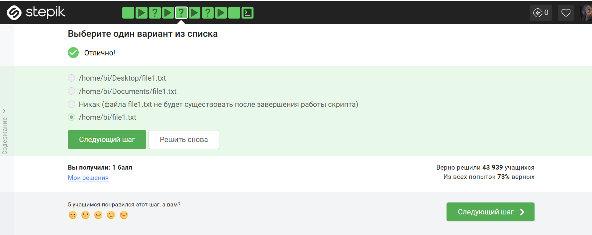{fig: 011 width=70%}

vari/able и var i able не верные варианты ответов. Т.к. в первом случае есть "/", а во втором пробелы. Это не соответсвует правилам наименования.
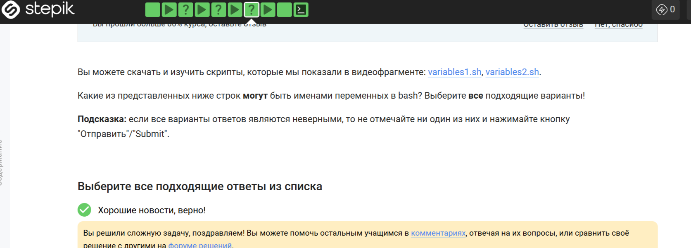{fig: 012 width=70%}
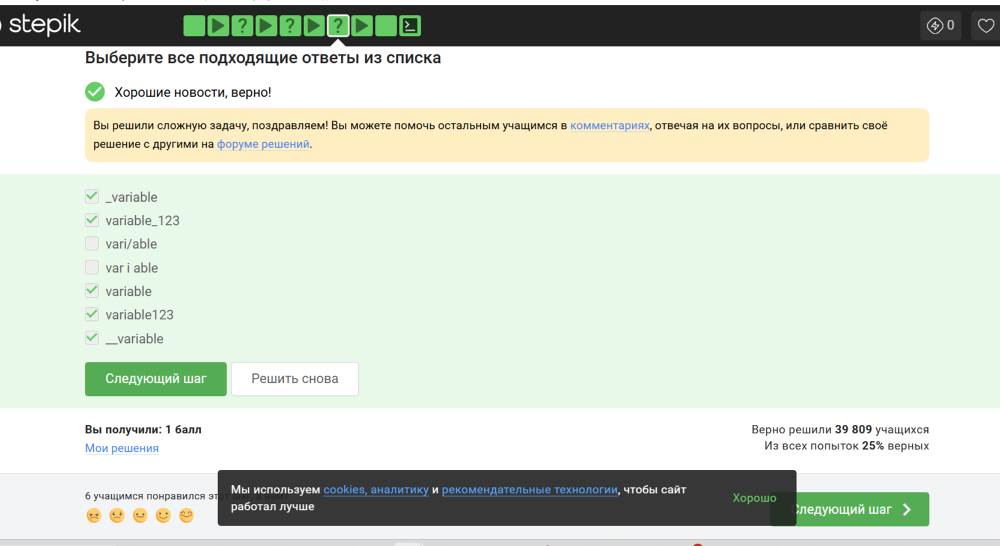{fig: 013 width=70%}

echo "Arguments are: \$1=$1 \$2=$2".
echo - команда для вывода строки.
\$1=$1 \$2=$2 - переменные позиционных параметров и первый со вторым аргументы, переданные скрипту.
Кавычки позволяют подставить значения $1 и $2, но экранированные  \$1 и  \$2.
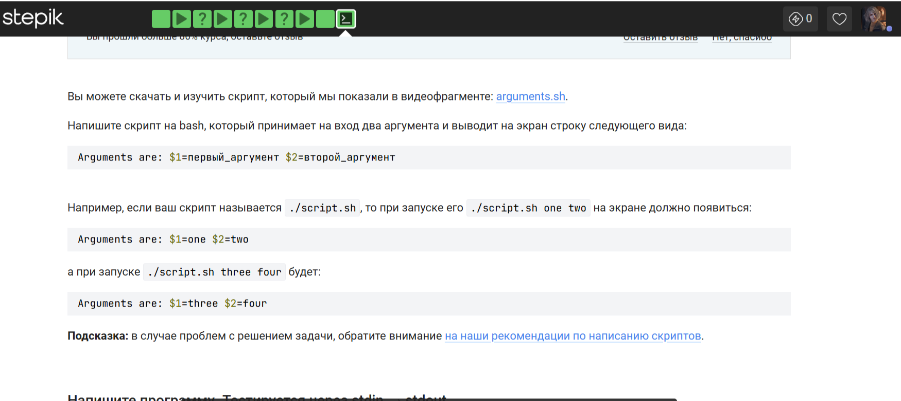{fig: 014 width=70%}
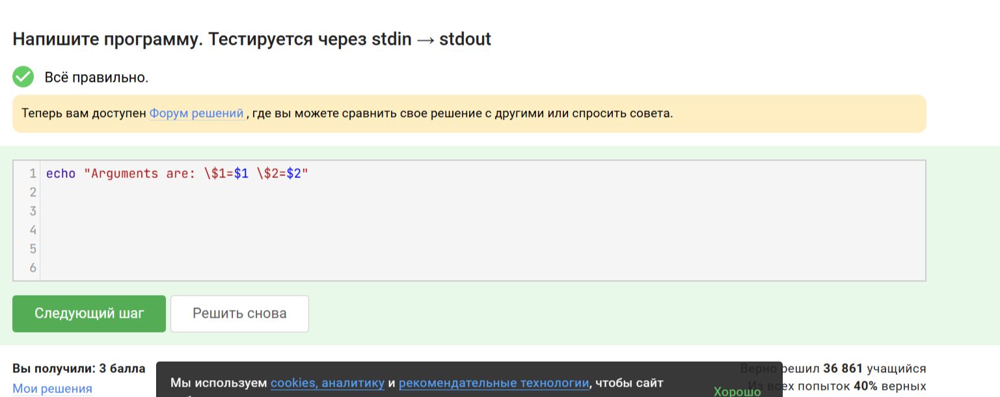{fig: 015 width=70%}

# Выполнение подраздела 3.3 Скрипты на bash: ветвления и циклы

$# -ge 0 - число аргументов всегда >= 0.
-s $0 - файл скрипта существует и не пуст.
-e $0 - файл скрипта существует.
И так далее, нам подходят все варианты.
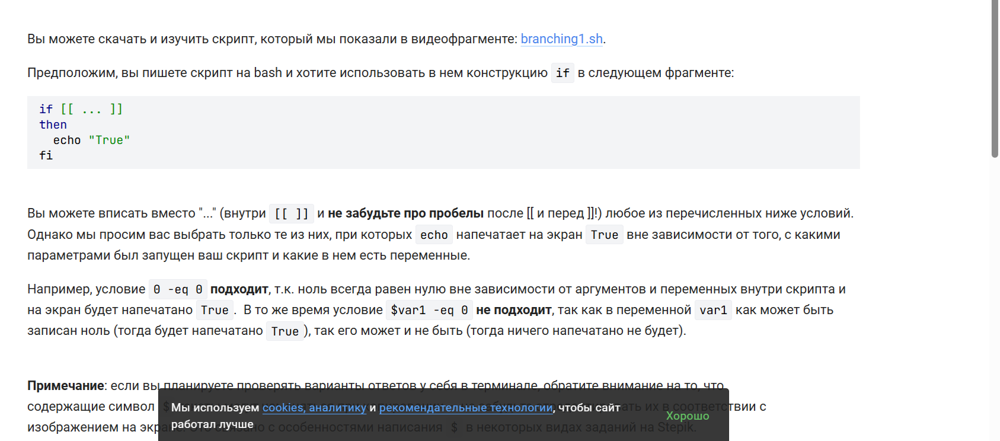{fig: 016 width=70%}
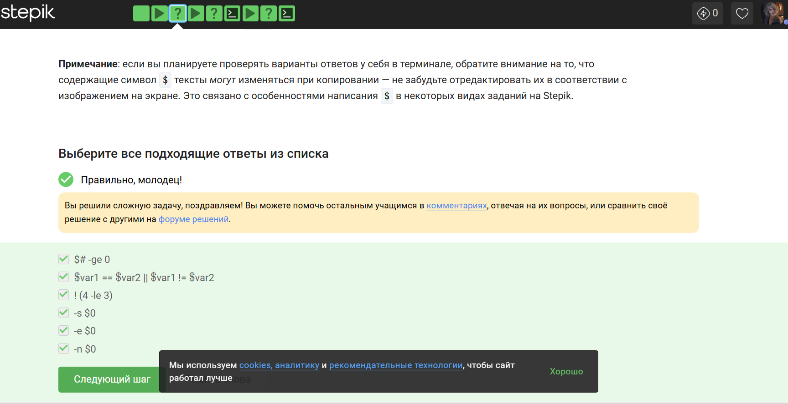{fig: 017 width=70%}

Сначала four, потом four - это верно.
Сначала four, при var=3. Затем four, при var =5
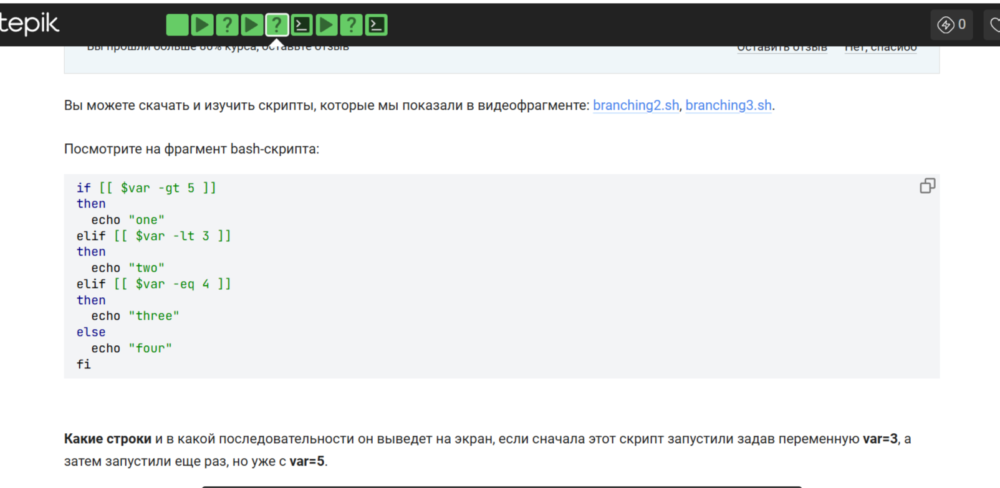{fig: 018 width=70%}
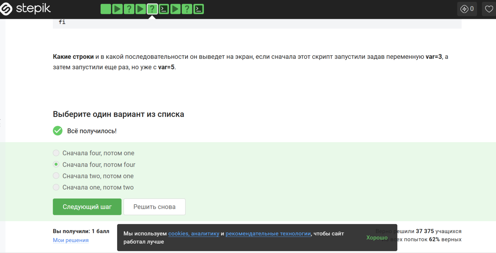{fig: 019 width=70%}

case $1 in - проверяет первый аргумент скрипта.
0) echo "No students" ;;
  1) echo "1 student" ;;
  2) echo "2 students" ;;
  3) echo "3 students" ;;
  4) echo "4 students" ;;  - каждая из этих веток выводит нужную строку.
  *) echo "A lot of students" ;; - срабатывает для любого значения, не подходящего под пункты выше.
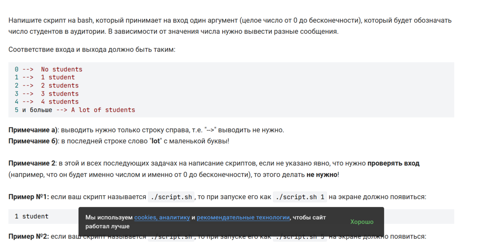{fig: 001 width=70%}
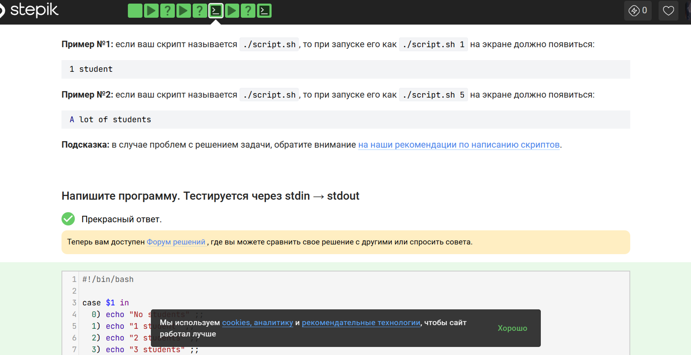{fig: 001 width=70%}
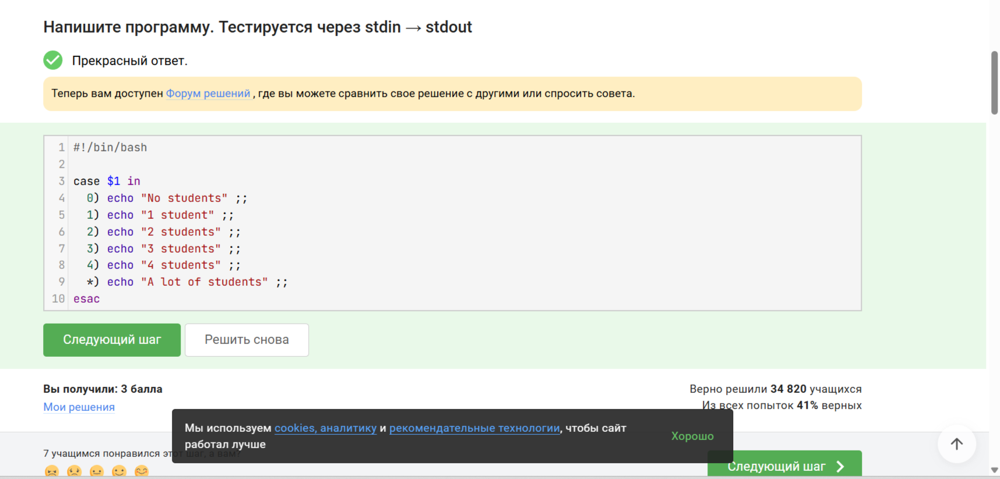{fig: 001 width=70%}

5 раз "start" и 4 раза "finish" - это верно.
start выводится при каждой итерации -> 5 раз.
finish выводится только тогда, когда не сработал continue -> 4 раза.
continue срабатывает только на последней итерации -  c_d.
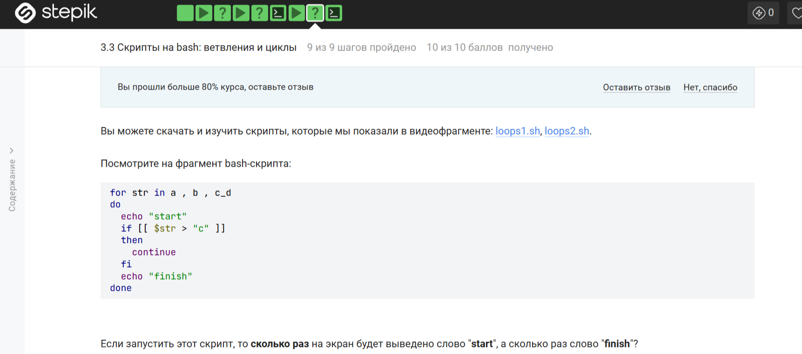{fig: 001 width=70%}
{fig: 001 width=70%}

Бесконечный цикл while true опрашивает пользователя снова и снова.
read name - ввод имени. Если имя пустое -z "$name", то вводится bye, цикл прерывается.
Ввод возраста - read age. Если возраст = 0, выводится bye и цикл прерывается.
2>/dev/null - проверка, чтобы вводили только числа, иначе ошибка.
После распределение на возрастные группы.
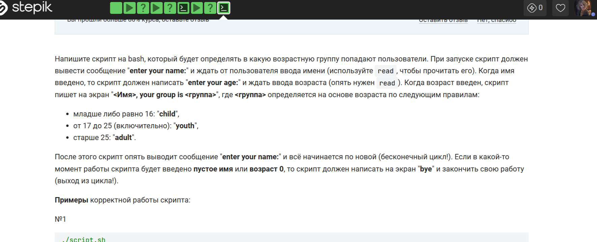{fig: 001 width=70%}
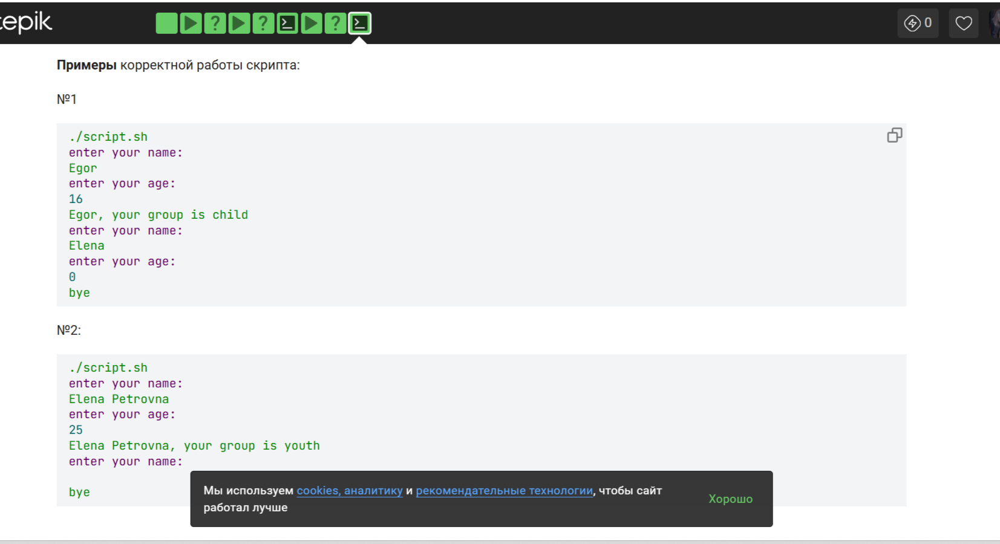{fig: 001 width=70%}
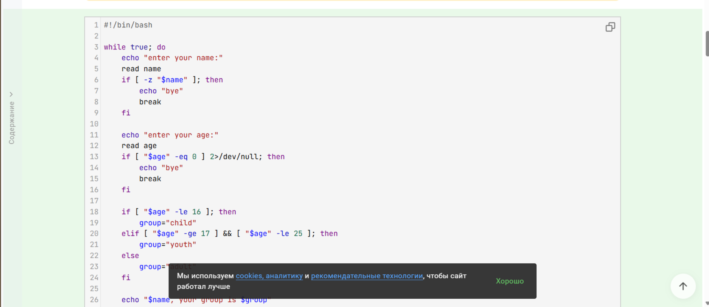{fig: 001 width=70%}
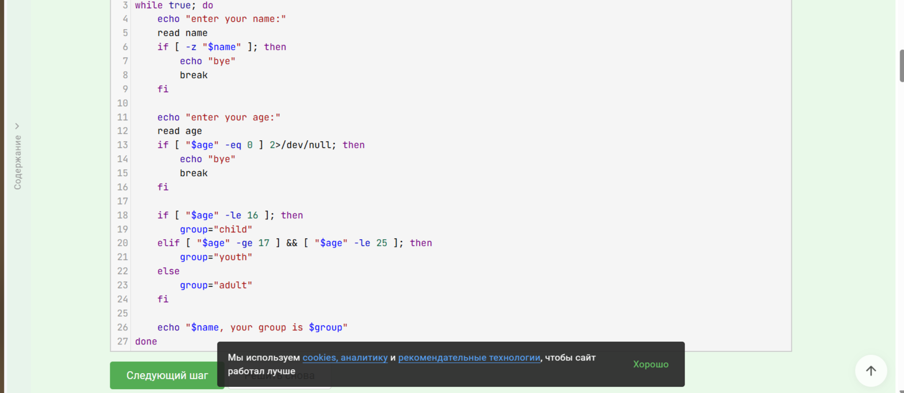{fig: 001 width=70%}

{fig: 001 width=70%}
{fig: 001 width=70%}
{fig: 001 width=70%}
{fig: 001 width=70%}
{fig: 001 width=70%}
{fig: 001 width=70%}
{fig: 001 width=70%}
